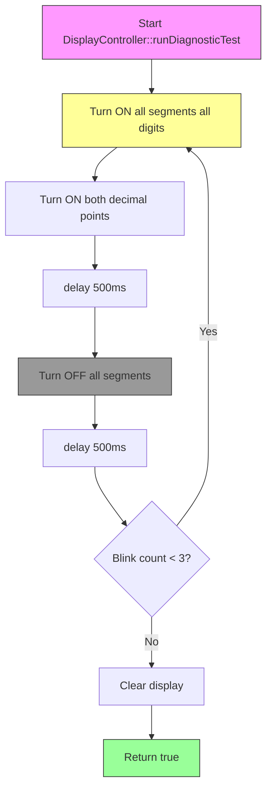

# Display 7-Segment Controller - Copilot Instructions

## Hardware Specifications

### Display Configuration

- **4× Seven-Segment Displays** (common cathode preferred)
- **Multiplexing**: Time-division multiplexing at >50Hz to exploit persistence of vision
- **Layout**: `D1:D2 D3:D4` where D2 and D3 are rotated 180° (digital clock effect)
- **Decimal Points**: 2 colon dots between D2:D3 for time separator

### Pin Assignments (Using 74HC595 Shift Registers)

```cpp
// Shift Register Control (3 pins for 8 segments + 4 digit selectors = 12 outputs)
const uint8_t DISPLAY_DATA_PIN = 3;   // DS (Serial Data)
const uint8_t DISPLAY_CLOCK_PIN = 4;  // SHCP (Shift Register Clock)
const uint8_t DISPLAY_LATCH_PIN = 5;  // STCP (Storage Register Clock)

// Alternative: Direct Pin Control (requires 12 pins)
// Segments: pins 3-10 (a,b,c,d,e,f,g,dp)
// Digits: pins A0-A3 (D1,D2,D3,D4)
```

## Architecture & Design Patterns

### DisplayController Class (lib/Utilities/DisplayController.h)

**Single Responsibility**: Manage 7-segment display hardware and multiplexing

```cpp
class DisplayController {
public:
    void begin();                          // Initialize hardware
    void displayTime(uint8_t h, uint8_t m); // Show HH:MM
    void runDiagnosticTest();              // Init test: all LEDs blink 0.5s
    void refresh();                        // Call in loop() for multiplexing
    
private:
    void writeDigit(uint8_t digit, uint8_t segments, bool dp);
    void selectDigit(uint8_t digitIndex);
    uint8_t getSegmentPattern(uint8_t number, bool rotated);
};
```

## Initialization Flowchart



### Pseudocode for Diagnostic Test

```cpp
bool DisplayController::runDiagnosticTest() {
    Serial.println(F("[DISPLAY] Diagnostic test..."));
    
    const uint8_t ALL_SEGMENTS_ON = 0xFF;  // All 8 bits HIGH
    const uint8_t BLINK_CYCLES = 3;
    const uint16_t BLINK_INTERVAL = 500;   // 0.5 seconds
    
    for (uint8_t cycle = 0; cycle < BLINK_CYCLES; cycle++) {
        // Turn ALL segments ON (including decimal points)
        for (uint8_t digit = 0; digit < 4; digit++) {
            writeDigit(digit, ALL_SEGMENTS_ON, true);
        }
        delay(BLINK_INTERVAL);
        
        // Turn ALL segments OFF
        clearDisplay();
        delay(BLINK_INTERVAL);
    }
    
    Serial.println(F("[DISPLAY] Test complete"));
    return true;
}
```

## Integration with SystemInitializer

**Add to Phase 3: Component Testing**

```cpp
// In SystemInitializer::testComponents()
if (display_) {
    Serial.println(F("[TEST] Display diagnostic..."));
    if (!display_->runDiagnosticTest()) {
        Serial.println(F("[ERROR] Display test failed!"));
        return false;
    }
    Serial.println(F("[OK] Display test passed"));
}
```

## Technical Constraints (Arduino Uno)

### Memory Budget

- **RAM**: ~1200 bytes available (after current code)
- **DisplayController estimate**: ~50 bytes (4 digit buffers + state)
- **Multiplexing timer**: Use `millis()` (no additional RAM)

### Timing Requirements

- **Refresh rate**: Minimum 50Hz (20ms per full cycle)
- **Per-digit time**: 5ms (20ms / 4 digits)
- **Non-blocking**: Use `refresh()` in `loop()`, not `delay()`

### Segment Encoding (Common Cathode)

```cpp
// Segments:  DP G F E D C B A
// Bit mask:  7  6 5 4 3 2 1 0
const uint8_t DIGIT_PATTERNS[10] = {
    0b00111111,  // 0
    0b00000110,  // 1
    0b01011011,  // 2
    0b01001111,  // 3
    0b01100110,  // 4
    0b01101101,  // 5
    0b01111101,  // 6
    0b00000111,  // 7
    0b01111111,  // 8
    0b01101111   // 9
};

// For rotated digits (D2, D3): XOR with rotation mask
const uint8_t ROTATION_180_MASK = 0b00111111;
```

## TDD Approach

### Test Structure (test/test_embedded/test_display_controller.cpp)

```cpp
void test_display_initialization() {
    DisplayController display;
    display.begin();
    // Assert: all segments OFF after init
}

void test_display_diagnostic_blinks() {
    // Assert: diagnostic runs 3 complete cycles
}

void test_display_number_patterns() {
    // Assert: digit 0-9 produce correct segment patterns
}

void test_display_rotation_for_digits_2_3() {
    // Assert: D2 and D3 use rotated segment patterns
}
```

---

**Key Principle**: Build incrementally following Red-Green-Refactor cycle. Start with segment pattern tests before hardware implementation.
