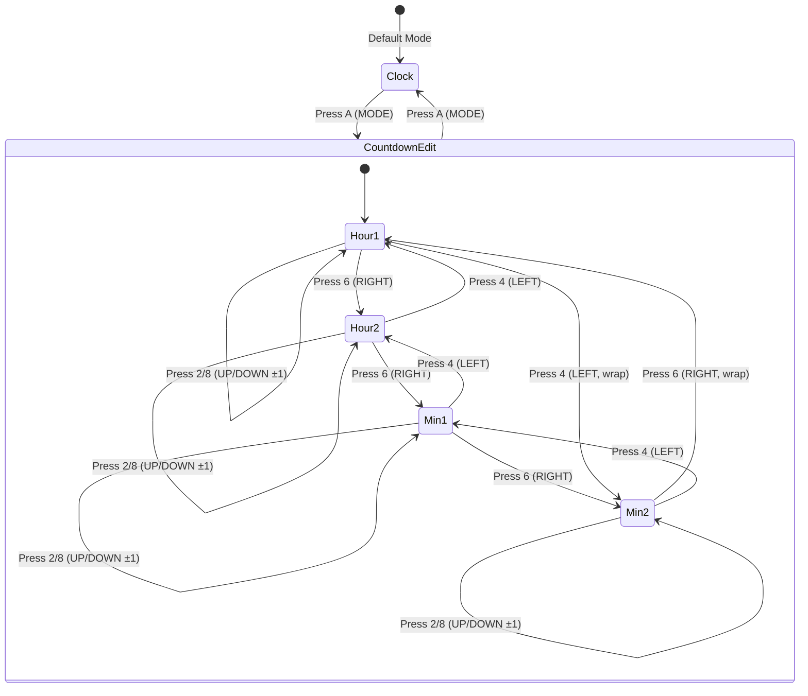

# Display Mode Selection & Countdown Setup - Copilot Instructions (UPDATED)

## Feature Overview

Implement mode selection system with:
1. **Mode Selection**: Clock vs Countdown
2. **Countdown Setup**: Navigate and modify HH:MM values using directional keys
3. **Visual Feedback**: Blinking cursor on selected digit
4. **Default Value**: 10:00 for countdown

## Hardware Interface

### Keypad Layout (4×4 Matrix) - Directional Navigation

```
┌───┬───┬───┬───┐
│ 1 │ 2 │ 3 │ A │  A = MODE (toggle Clock/Countdown)
│   │ ↑ │   │   │  2 = UP (increment selected digit)
├───┼───┼───┼───┤
│ 4 │ 5 │ 6 │ B │  4 = LEFT (move cursor ←)
│ ← │   │ → │   │  6 = RIGHT (move cursor →)
├───┼───┼───┼───┤
│ 7 │ 8 │ 9 │ C │  8 = DOWN (decrement selected digit)
│   │ ↓ │   │   │
├───┼───┼───┼───┤
│ * │ 0 │ # │ D │  B, C, D = Reserved for future features
└───┴───┴───┴───┘
```

### Key Mapping
```cpp
// Directional keys (D-pad style)
KEY_4 → LEFT   // Move cursor: H1←H2←M1←M2 (with wrap)
KEY_6 → RIGHT  // Move cursor: H1→H2→M1→M2 (with wrap)
KEY_2 → UP     // Increment digit at cursor (+1)
KEY_8 → DOWN   // Decrement digit at cursor (-1)

// Mode control
KEY_A → MODE   // Toggle Clock ↔ Countdown
```

## Architecture

### State Machine for Display Modes



## Class Design

### DisplayMode Enum (Simplified)
```cpp
enum class DisplayMode {
    CLOCK,           // Show current time
    COUNTDOWN_EDIT   // Edit countdown value (with cursor)
};
```

### CountdownController Class (lib/Utilities/CountdownController.h)

```cpp
class CountdownController {
public:
    void begin();
    void setTime(uint8_t hours, uint8_t minutes);
    void getTime(uint8_t& hours, uint8_t& minutes);
    
    // Cursor management with directional navigation
    void setCursorPosition(uint8_t pos);  // 0=H1, 1=H2, 2=M1, 3=M2
    uint8_t getCursorPosition() const;
    void moveCursorLeft();   // 4 key
    void moveCursorRight();  // 6 key
    
    // Value modification with directional keys
    void incrementCurrentDigit();  // 2 key (UP)
    void decrementCurrentDigit();  // 8 key (DOWN)
    
    // Display state
    bool shouldBlinkDigit(uint8_t digitIndex, unsigned long currentMillis);
    
private:
    uint8_t hours_;      // 0-23 (countdown hours)
    uint8_t minutes_;    // 0-59
    uint8_t cursorPos_;  // 0-3 (H1, H2, M1, M2)
    
    const uint16_t BLINK_INTERVAL = 500;  // 0.5s on/off
};
```

### KeypadController Class (lib/Utilities/KeypadController.h)

```cpp
enum class KeypadKey {
    KEY_0, KEY_1, KEY_2, KEY_3, KEY_4, KEY_5, 
    KEY_6, KEY_7, KEY_8, KEY_9,
    KEY_STAR,      // *
    KEY_HASH,      // #
    KEY_A,         // MODE
    KEY_B,         // Reserved
    KEY_C,         // Reserved
    KEY_D,         // Reserved
    KEY_NONE
};

class KeypadController {
public:
    void begin();
    KeypadKey scan();  // Non-blocking scan, returns KEY_NONE if no press
    
    // Helper: map numeric keys to navigation actions
    bool isDirectionalKey(KeypadKey key) const;
    
private:
    uint8_t rowPins_[4];
    uint8_t colPins_[4];
    unsigned long lastKeyTime_;
    KeypadKey lastKey_;
    const uint16_t DEBOUNCE_DELAY = 50;
};
```

## Main Loop Integration

### Key Press Handler with Directional Navigation

```cpp
void handleKeyPress(KeypadKey key) {
    switch (key) {
        case KeypadKey::KEY_A:  // MODE toggle
            if (currentMode == DisplayMode::CLOCK) {
                currentMode = DisplayMode::COUNTDOWN_EDIT;
                countdown.setCursorPosition(0);  // Start at H1
                Serial.println(F("[MODE] Countdown edit mode"));
                Serial.println(F("[CURSOR] Position: 0 (H1) - BLINKING"));
            } else {
                currentMode = DisplayMode::CLOCK;
                Serial.println(F("[MODE] Clock mode"));
            }
            break;
            
        case KeypadKey::KEY_4:  // LEFT arrow
            if (currentMode == DisplayMode::COUNTDOWN_EDIT) {
                countdown.moveCursorLeft();
                logCursorPosition();
            }
            break;
            
        case KeypadKey::KEY_6:  // RIGHT arrow
            if (currentMode == DisplayMode::COUNTDOWN_EDIT) {
                countdown.moveCursorRight();
                logCursorPosition();
            }
            break;
            
        case KeypadKey::KEY_2:  // UP arrow (increment)
            if (currentMode == DisplayMode::COUNTDOWN_EDIT) {
                countdown.incrementCurrentDigit();
                logCountdownValue();
            }
            break;
            
        case KeypadKey::KEY_8:  // DOWN arrow (decrement)
            if (currentMode == DisplayMode::COUNTDOWN_EDIT) {
                countdown.decrementCurrentDigit();
                logCountdownValue();
            }
            break;
            
        default:
            // Ignore other keys for now
            break;
    }
}
```

## Cursor Navigation Logic

### Bidirectional Wrapping
```cpp
void CountdownController::moveCursorRight() {
    cursorPos_ = (cursorPos_ + 1) % 4;  // 0→1→2→3→0 (wrap)
}

void CountdownController::moveCursorLeft() {
    cursorPos_ = (cursorPos_ == 0) ? 3 : cursorPos_ - 1;  // 0←1←2←3←0 (wrap)
}
```

### Cursor Position Mapping
```
Position 0: H1 (hours tens)     → Display digit D1
Position 1: H2 (hours units)    → Display digit D2
Position 2: M1 (minutes tens)   → Display digit D3
Position 3: M2 (minutes units)  → Display digit D4

Navigation:
  LEFT (4):  0 ← 1 ← 2 ← 3 ← 0
  RIGHT (6): 0 → 1 → 2 → 3 → 0
```

## Serial Logging Format

```cpp
// Mode changes
Serial.println(F("[MODE] Clock mode"));
Serial.println(F("[MODE] Countdown edit mode"));

// Cursor movement with visual indicator
void logCursorPosition() {
    uint8_t pos = countdown.getCursorPosition();
    const char* labels[] = {"H1", "H2", "M1", "M2"};
    
    Serial.print(F("[CURSOR] Position: "));
    Serial.print(pos);
    Serial.print(F(" ("));
    Serial.print(labels[pos]);
    Serial.println(F(") - BLINKING"));
}

// Value changes
void logCountdownValue() {
    uint8_t h, m;
    countdown.getTime(h, m);
    
    Serial.print(F("[VALUE] Countdown: "));
    if (h < 10) Serial.print(F("0"));
    Serial.print(h);
    Serial.print(F(":"));
    if (m < 10) Serial.print(F("0"));
    Serial.println(m);
}
```

## Display Behavior Specification

### Countdown Edit Mode with Blinking Cursor

```
Time: 10:23, Cursor on M1 (position 2)

Cycle 1 (0-500ms):   1 0 : 2 3    ← All visible
Cycle 2 (500-1000ms): 1 0 : _ 3    ← M1 blank (blink off)
Cycle 3 (1000-1500ms): 1 0 : 2 3    ← M1 visible (blink on)

User presses KEY_6 (RIGHT) → Cursor moves to M2

Cycle 4 (1500-2000ms): 1 0 : 2 3    ← All visible
Cycle 5 (2000-2500ms): 1 0 : 2 _    ← M2 blank (blink off)
...
```

## Digit Increment/Decrement Rules (with UP/DOWN keys)

```cpp
void CountdownController::incrementCurrentDigit() {
    uint8_t h1 = hours_ / 10;
    uint8_t h2 = hours_ % 10;
    uint8_t m1 = minutes_ / 10;
    uint8_t m2 = minutes_ % 10;
    
    switch (cursorPos_) {
        case 0:  // H1 (tens of hours)
            h1 = (h1 >= 2) ? 0 : h1 + 1;  // Cycle 0→1→2→0
            if (h1 == 2 && h2 > 3) h2 = 3;  // Max 23:59
            break;
            
        case 1:  // H2 (units of hours)
            if (h1 == 2) {
                h2 = (h2 >= 3) ? 0 : h2 + 1;  // Max 23
            } else {
                h2 = (h2 >= 9) ? 0 : h2 + 1;  // 0-9
            }
            break;
            
        case 2:  // M1 (tens of minutes)
            m1 = (m1 >= 5) ? 0 : m1 + 1;  // Cycle 0→5→0
            break;
            
        case 3:  // M2 (units of minutes)
            m2 = (m2 >= 9) ? 0 : m2 + 1;  // Cycle 0→9→0
            break;
    }
    
    hours_ = h1 * 10 + h2;
    minutes_ = m1 * 10 + m2;
}

void CountdownController::decrementCurrentDigit() {
    uint8_t h1 = hours_ / 10;
    uint8_t h2 = hours_ % 10;
    uint8_t m1 = minutes_ / 10;
    uint8_t m2 = minutes_ % 10;
    
    switch (cursorPos_) {
        case 0:  // H1
            h1 = (h1 == 0) ? 2 : h1 - 1;  // Cycle 2←1←0←2
            if (h1 == 2 && h2 > 3) h2 = 3;
            break;
            
        case 1:  // H2
            if (h1 == 2) {
                h2 = (h2 == 0) ? 3 : h2 - 1;  // Max 23
            } else {
                h2 = (h2 == 0) ? 9 : h2 - 1;
            }
            break;
            
        case 2:  // M1
            m1 = (m1 == 0) ? 5 : m1 - 1;
            break;
            
        case 3:  // M2
            m2 = (m2 == 0) ? 9 : m2 - 1;
            break;
    }
    
    hours_ = h1 * 10 + h2;
    minutes_ = m1 * 10 + m2;
}
```

## TDD Test Cases

### Test Structure (test/test_embedded/test_countdown_controller.cpp)

```cpp
void test_countdown_default_value_10_00() {
    CountdownController ctrl;
    ctrl.begin();
    uint8_t h, m;
    ctrl.getTime(h, m);
    TEST_ASSERT_EQUAL(10, h);
    TEST_ASSERT_EQUAL(0, m);
}

void test_cursor_move_right_with_wrap() {
    // Assert: 0→1→2→3→0 (KEY_6)
}

void test_cursor_move_left_with_wrap() {
    // Assert: 0←1←2←3←0 (KEY_4)
}

void test_increment_h1_cycles_0_1_2() {
    // Position 0, KEY_2: 0→1→2→0
}

void test_decrement_m2_cycles_9_to_0() {
    // Position 3, KEY_8: 9←8←...←1←0←9
}

void test_max_hours_limit_23() {
    // Assert: cannot exceed 23:59
}

void test_keypad_directional_mapping() {
    // Assert: KEY_4=LEFT, KEY_6=RIGHT, KEY_2=UP, KEY_8=DOWN
}

void test_blink_only_at_cursor() {
    // Assert: only digit at cursorPos_ blinks
}
```

## Visual Navigation Example (Serial Log)

```
[MODE] Countdown edit mode
[CURSOR] Position: 0 (H1) - BLINKING
[VALUE] Countdown: 10:00

→ User presses KEY_2 (UP)
[VALUE] Countdown: 20:00

→ User presses KEY_6 (RIGHT)
[CURSOR] Position: 1 (H2) - BLINKING

→ User presses KEY_8 (DOWN)
[VALUE] Countdown: 19:00

→ User presses KEY_6 (RIGHT)
[CURSOR] Position: 2 (M1) - BLINKING

→ User presses KEY_2 (UP) × 3
[VALUE] Countdown: 19:30

→ User presses KEY_4 (LEFT)
[CURSOR] Position: 1 (H2) - BLINKING

→ User presses KEY_A (MODE)
[MODE] Clock mode
```

## Memory Considerations

- **KeypadController**: ~30 bytes
- **CountdownController**: ~10 bytes
- **Mode enum + state**: ~2 bytes
- **Total added**: ~42 bytes

Current free RAM: ~1200 bytes → After implementation: ~1158 bytes (safe)

---

**Implementation Priority (TDD)**:
1. CountdownController digit manipulation tests
2. Cursor navigation (LEFT/RIGHT) tests
3. KeypadController directional key mapping
4. Integration tests with serial logging
5. Display blinking behavior verification