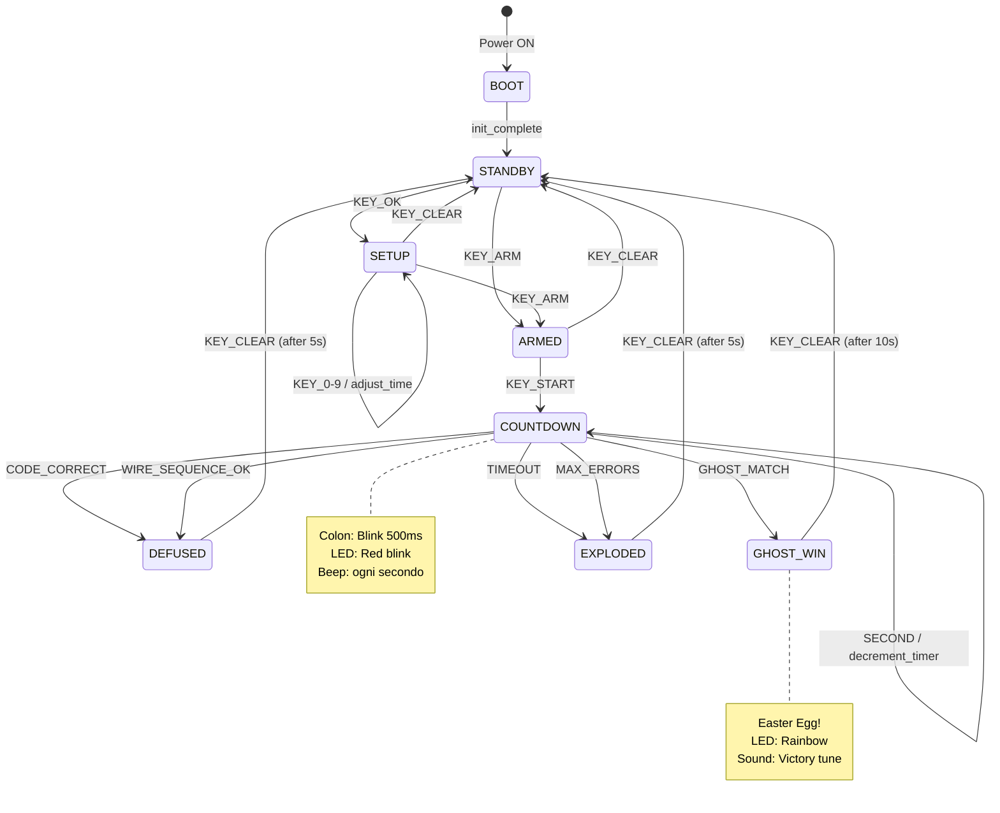
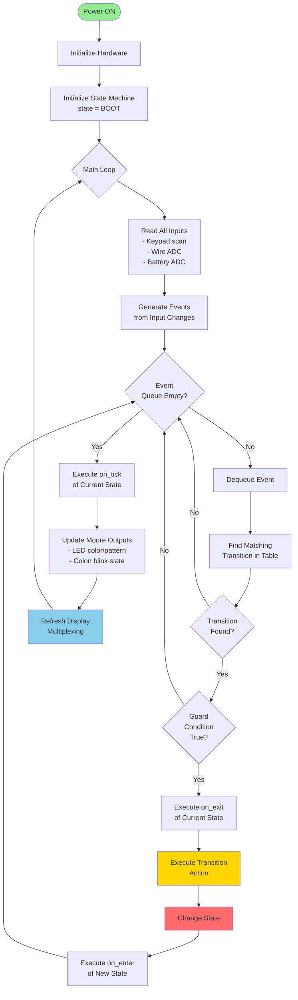
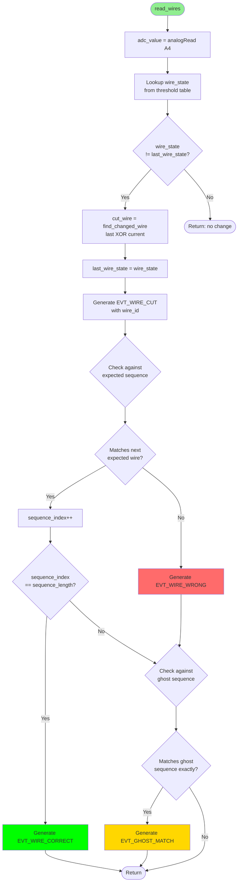

# TacBomb Pro — Piano di Sviluppo Prototipo Completo

## Metadata
- **Versione**: 1.0.0-prototype
- **Timebox**: 2 giorni (16 ore effettive)
- **Metodologia**: XP Programming + Kanban
- **Principi**: DRY, SOLID, Clean Code, KISS, YAGNI

---

# PARTE 1: STRUTTURA AGILE

## 1.1 Product Backlog Overview

```
┌─────────────────────────────────────────────────────────────────────────────┐
│                         PRODUCT BACKLOG - TacBomb Pro                       │
├─────────────────────────────────────────────────────────────────────────────┤
│                                                                             │
│  EPIC 1: Core Hardware Setup                              [4h] ████░░░░    │
│  EPIC 2: Display & UI System                              [3h] ███░░░░░    │
│  EPIC 3: Input Management                                 [2h] ██░░░░░░    │
│  EPIC 4: Game Logic Engine                                [4h] ████░░░░    │
│  EPIC 5: Audio Feedback System                            [1h] █░░░░░░░    │
│  EPIC 6: Easter Egg - Ghost Wire                          [1h] █░░░░░░░    │
│  EPIC 7: Integration & Polish                             [1h] █░░░░░░░    │
│                                                                             │
│  TOTALE: 16 ore (2 giorni)                                                 │
│                                                                             │
└─────────────────────────────────────────────────────────────────────────────┘
```

---

## 1.2 EPIC 1: Core Hardware Setup

### Story 1.1: Inizializzazione MCU
**Come** sviluppatore  
**Voglio** configurare correttamente l'ATmega328P  
**Per** avere una base stabile per tutto il firmware

#### Tasks:

| ID | Task | Stima | Acceptance Criteria (BDD) |
|----|------|-------|---------------------------|
| T1.1.1 | Setup clock 16MHz | 15min | **Given** MCU powered on **When** system initializes **Then** F_CPU equals 16000000 |
| T1.1.2 | Configurazione porte I/O | 30min | **Given** all pins defined **When** init_io() called **Then** DDRB, DDRC, DDRD match pinout spec |
| T1.1.3 | Setup Timer0 (1ms tick) | 30min | **Given** Timer0 configured **When** 1000 interrupts fire **Then** elapsed time equals 1000ms ±1% |
| T1.1.4 | Setup Timer2 (audio PWM) | 15min | **Given** Timer2 in CTC mode **When** frequency set to 1000Hz **Then** buzzer output matches |

### Story 1.2: Power Management
**Come** utente  
**Voglio** monitorare lo stato della batteria  
**Per** sapere quando sostituirla

#### Tasks:

| ID | Task | Stima | Acceptance Criteria (BDD) |
|----|------|-------|---------------------------|
| T1.2.1 | ADC setup per battery | 20min | **Given** ADC5 configured **When** read_battery() called **Then** returns voltage 0-6V scaled |
| T1.2.2 | Soglie batteria | 10min | **Given** voltage thresholds defined **When** V < 4.6V **Then** state is CRITICAL |

---

## 1.3 EPIC 2: Display & UI System

### Story 2.1: Driver Display 7-Segmenti
**Come** utente  
**Voglio** vedere il countdown su display  
**Per** sapere quanto tempo rimane

#### Tasks:

| ID | Task | Stima | Acceptance Criteria (BDD) |
|----|------|-------|---------------------------|
| T2.1.1 | Shift register driver | 30min | **Given** 74HC595 connected **When** shift_out(0x3F) called **Then** digit shows "0" |
| T2.1.2 | Multiplexing 4 digit | 45min | **Given** 4 digits configured **When** refresh runs at 400Hz **Then** no visible flicker |
| T2.1.3 | Segment lookup table | 15min | **Given** digits 0-9 **When** get_segments(n) called **Then** correct pattern returned |

### Story 2.2: Gestione Colon Lampeggiante
**Come** utente  
**Voglio** vedere il colon ":" lampeggiare  
**Per** percepire il passaggio del tempo

#### Tasks:

| ID | Task | Stima | Acceptance Criteria (BDD) |
|----|------|-------|---------------------------|
| T2.2.1 | Colon timing 500ms | 20min | **Given** countdown mode **When** 1 second passes **Then** colon toggles twice |
| T2.2.2 | Colon fisso in setup | 10min | **Given** setup mode **When** display refreshes **Then** colon always visible |
| T2.2.3 | Digit blink in select | 15min | **Given** digit selected **When** 500ms passes **Then** digit toggles visibility twice |

### Story 2.3: LED RGB Status
**Come** utente  
**Voglio** vedere lo stato tramite colore LED  
**Per** capire immediatamente la situazione

#### Tasks:

| ID | Task | Stima | Acceptance Criteria (BDD) |
|----|------|-------|---------------------------|
| T2.3.1 | LED color mapping | 15min | **Given** state ARMED **When** led_update() called **Then** LED is YELLOW |
| T2.3.2 | LED blink patterns | 20min | **Given** state COUNTDOWN **When** time < 60s **Then** RED blinks fast (250ms) |

---

## 1.4 EPIC 3: Input Management

### Story 3.1: Keypad Scanner
**Come** utente  
**Voglio** inserire codici con tastierino  
**Per** tentare di disattivare la bomba

#### Tasks:

| ID | Task | Stima | Acceptance Criteria (BDD) |
|----|------|-------|---------------------------|
| T3.1.1 | Matrix scan 4x4 | 30min | **Given** key "5" pressed **When** scan_keypad() called **Then** returns KEY_5 |
| T3.1.2 | Debounce software 50ms | 20min | **Given** key bouncing **When** multiple edges in 50ms **Then** single keypress reported |
| T3.1.3 | Key repeat prevention | 15min | **Given** key held **When** 500ms passes **Then** no repeat events generated |

### Story 3.2: Wire Sensing
**Come** giocatore  
**Voglio** tagliare fili per disattivare  
**Per** avere un'alternativa al codice

#### Tasks:

| ID | Task | Stima | Acceptance Criteria (BDD) |
|----|------|-------|---------------------------|
| T3.2.1 | ADC ladder reading | 30min | **Given** all wires connected **When** read_wires() called **Then** returns 0b1111 |
| T3.2.2 | Wire state detection | 20min | **Given** wire 2 cut **When** read_wires() called **Then** returns 0b1101 |
| T3.2.3 | Wire cut event | 15min | **Given** wire state changes **When** wire_check() runs **Then** WIRE_CUT event fired |

---

## 1.5 EPIC 4: Game Logic Engine

### Story 4.1: State Machine Core
**Come** sistema  
**Voglio** gestire gli stati di gioco  
**Per** garantire comportamento prevedibile

#### Tasks:

| ID | Task | Stima | Acceptance Criteria (BDD) |
|----|------|-------|---------------------------|
| T4.1.1 | State enum definition | 15min | **Given** all states defined **When** compiled **Then** no duplicate values |
| T4.1.2 | Transition table | 30min | **Given** state ARMED, event START **When** transition() called **Then** new state is COUNTDOWN |
| T4.1.3 | State entry/exit actions | 30min | **Given** entering COUNTDOWN **When** on_enter() called **Then** timer starts |

### Story 4.2: Countdown Logic
**Come** giocatore  
**Voglio** vedere il tempo scorrere  
**Per** sentire la tensione del gioco

#### Tasks:

| ID | Task | Stima | Acceptance Criteria (BDD) |
|----|------|-------|---------------------------|
| T4.2.1 | Timer decrement | 20min | **Given** countdown at 09:45 **When** 1 second passes **Then** display shows 09:44 |
| T4.2.2 | Timer expiry | 15min | **Given** countdown at 00:01 **When** 1 second passes **Then** state becomes EXPLODED |
| T4.2.3 | Time penalty | 15min | **Given** wrong code entered **When** penalty applied **Then** time reduced by 30s |

### Story 4.3: Defusal Logic
**Come** giocatore  
**Voglio** disattivare con codice o fili  
**Per** vincere la partita

#### Tasks:

| ID | Task | Stima | Acceptance Criteria (BDD) |
|----|------|-------|---------------------------|
| T4.3.1 | Code verification | 20min | **Given** secret code "7294" **When** player enters "7294" **Then** state becomes DEFUSED |
| T4.3.2 | Wire sequence check | 25min | **Given** sequence [RED,GREEN] **When** player cuts RED then GREEN **Then** DEFUSED |
| T4.3.3 | Error counting | 15min | **Given** 2 errors **When** third error occurs **Then** state becomes EXPLODED |

### Story 4.4: Random Generation
**Come** sistema  
**Voglio** generare codici e sequenze random  
**Per** rendere ogni partita unica

#### Tasks:

| ID | Task | Stima | Acceptance Criteria (BDD) |
|----|------|-------|---------------------------|
| T4.4.1 | PRNG seeding | 15min | **Given** floating ADC pin **When** seed_random() called **Then** seed is unpredictable |
| T4.4.2 | Code generation | 15min | **Given** random seeded **When** generate_code() called **Then** returns 4-digit 0000-9999 |
| T4.4.3 | Wire sequence gen | 20min | **Given** 4 wires active **When** generate_sequence() called **Then** returns permutation |

---

## 1.6 EPIC 5: Audio Feedback System

### Story 5.1: Tone Generation
**Come** utente  
**Voglio** sentire feedback sonori  
**Per** essere avvisato degli eventi

#### Tasks:

| ID | Task | Stima | Acceptance Criteria (BDD) |
|----|------|-------|---------------------------|
| T5.1.1 | Frequency generation | 20min | **Given** tone(1000) called **When** buzzer measured **Then** frequency is 1000Hz ±5% |
| T5.1.2 | Beep patterns | 20min | **Given** countdown active **When** second ticks **Then** short beep plays |
| T5.1.3 | Explosion sound | 15min | **Given** state EXPLODED **When** entered **Then** low continuous tone 5s |

---

## 1.7 EPIC 6: Easter Egg - Ghost Wire 👻

### Story 6.1: Ghost Wire Sequence
**Come** giocatore esperto  
**Voglio** una sfida nascosta  
**Per** scoprire segreti e vantarmi

#### Tasks:

| ID | Task | Stima | Acceptance Criteria (BDD) |
|----|------|-------|---------------------------|
| T6.1.1 | Ghost sequence generation | 20min | **Given** game starts **When** ghost_init() called **Then** hidden sequence created |
| T6.1.2 | Ghost sequence tracking | 25min | **Given** ghost sequence [G,R,Y,O] **When** player cuts G,R,Y,O exactly **Then** GHOST_DEFUSED |
| T6.1.3 | Ghost success feedback | 15min | **Given** ghost defused **When** success **Then** special rainbow LED pattern plays |

---

## 1.8 EPIC 7: Integration & Polish

### Story 7.1: System Integration
**Come** sviluppatore  
**Voglio** integrare tutti i moduli  
**Per** avere un sistema funzionante

#### Tasks:

| ID | Task | Stima | Acceptance Criteria (BDD) |
|----|------|-------|---------------------------|
| T7.1.1 | Main loop integration | 30min | **Given** all modules ready **When** main runs **Then** all subsystems cooperate |
| T7.1.2 | EEPROM settings | 20min | **Given** settings changed **When** power cycled **Then** settings persist |
| T7.1.3 | Smoke test full game | 10min | **Given** complete system **When** full game played **Then** all features work |

---

# PARTE 2: STATE MACHINE DESIGN

## 2.1 Standard e Pattern per State Machine

### Standard Utilizzati

```
┌─────────────────────────────────────────────────────────────────────────────┐
│                    STATE MACHINE STANDARDS & PATTERNS                       │
├─────────────────────────────────────────────────────────────────────────────┤
│                                                                             │
│  1. UML STATE DIAGRAM (Harel Statecharts)                                  │
│     - Standard OMG UML 2.5.1                                               │
│     - Stati, transizioni, eventi, guardie, azioni                          │
│     - Supporta stati gerarchici (nested states)                            │
│                                                                             │
│  2. MEALY MACHINE                                                          │
│     - Output dipende da stato corrente + input                             │
│     - Usata per: feedback immediato a input utente                         │
│     - Formula: Output = f(State, Input)                                    │
│                                                                             │
│  3. MOORE MACHINE                                                          │
│     - Output dipende solo dallo stato corrente                             │
│     - Usata per: LED status, display mode                                  │
│     - Formula: Output = f(State)                                           │
│                                                                             │
│  4. HIERARCHICAL STATE MACHINE (HSM)                                       │
│     - Pattern Miro Samek (QP Framework style)                              │
│     - Stati parent/child per riuso comportamento                           │
│     - Transizioni ereditate                                                │
│                                                                             │
│  5. TABLE-DRIVEN FSM                                                       │
│     - Transition table in ROM/Flash                                        │
│     - Lookup O(1) per transizioni                                          │
│     - Facile da verificare e testare                                       │
│                                                                             │
├─────────────────────────────────────────────────────────────────────────────┤
│                                                                             │
│  PATTERN SCELTO PER TACBOMB PRO:                                           │
│  ════════════════════════════════                                          │
│                                                                             │
│  Hybrid: Table-Driven FSM + Moore (outputs) + Mealy (transitions)          │
│                                                                             │
│  Motivazioni:                                                               │
│  - Table-driven: facile debug, modifiche senza ricompilare logica         │
│  - Moore per LED/Display: output prevedibile per ogni stato               │
│  - Mealy per audio: feedback immediato su eventi                          │
│  - No HSM: complessità non giustificata per 8 stati                       │
│                                                                             │
└─────────────────────────────────────────────────────────────────────────────┘
```

### Struttura Dati State Machine

```c
// === STATE MACHINE STRUCTURE ===

typedef enum {
    STATE_BOOT,         // 0: Inizializzazione sistema
    STATE_STANDBY,      // 1: Attesa, pronto per configurazione
    STATE_SETUP,        // 2: Configurazione timer/modalità
    STATE_ARMED,        // 3: Armato, pronto per start
    STATE_COUNTDOWN,    // 4: Timer attivo, gioco in corso
    STATE_DEFUSED,      // 5: Disinnescato con successo
    STATE_EXPLODED,     // 6: Timer scaduto o troppi errori
    STATE_GHOST_WIN     // 7: Easter egg - Ghost wire success
} State_t;

typedef enum {
    EVT_NONE,           // Nessun evento
    EVT_TICK,           // Timer tick (ogni 1ms)
    EVT_SECOND,         // Secondo passato
    EVT_KEY_PRESS,      // Tasto premuto (con keycode)
    EVT_KEY_ARM,        // Tasto ARM premuto
    EVT_KEY_START,      // Tasto START premuto
    EVT_KEY_OK,         // Tasto OK premuto
    EVT_KEY_CLEAR,      // Tasto CLEAR premuto
    EVT_WIRE_CUT,       // Filo tagliato (con wire_id)
    EVT_CODE_CORRECT,   // Codice inserito corretto
    EVT_CODE_WRONG,     // Codice inserito errato
    EVT_WIRE_CORRECT,   // Sequenza fili corretta
    EVT_WIRE_WRONG,     // Filo sbagliato tagliato
    EVT_GHOST_MATCH,    // Easter egg: sequenza ghost corretta
    EVT_TIMEOUT,        // Timer scaduto
    EVT_MAX_ERRORS,     // Raggiunto limite errori
    EVT_BATTERY_LOW,    // Batteria sotto soglia
    EVT_RESET           // Reset richiesto
} Event_t;

typedef struct {
    State_t current_state;
    State_t next_state;
    Event_t trigger_event;
    bool (*guard)(void);        // Condizione opzionale
    void (*action)(void);       // Azione sulla transizione
} Transition_t;

typedef struct {
    void (*on_enter)(void);     // Azione ingresso stato
    void (*on_exit)(void);      // Azione uscita stato
    void (*on_tick)(void);      // Azione periodica nello stato
    uint8_t led_color;          // Moore output: colore LED
    uint8_t led_pattern;        // Moore output: pattern lampeggio
    bool colon_blink;           // Moore output: colon lampeggia?
} StateConfig_t;
```

---

## 2.2 Diagramma Stati Principale



---

## 2.3 Transition Table (Implementazione)

```c
// === TRANSITION TABLE ===
// Ordinata per priorità: prima le transizioni più specifiche

const Transition_t transitions[] = {
    // FROM STATE      TO STATE       EVENT            GUARD              ACTION
    
    // BOOT transitions
    { STATE_BOOT,      STATE_STANDBY, EVT_NONE,        init_complete,     NULL },
    
    // STANDBY transitions  
    { STATE_STANDBY,   STATE_SETUP,   EVT_KEY_OK,      NULL,              enter_setup },
    { STATE_STANDBY,   STATE_ARMED,   EVT_KEY_ARM,     NULL,              arm_device },
    
    // SETUP transitions
    { STATE_SETUP,     STATE_STANDBY, EVT_KEY_CLEAR,   NULL,              cancel_setup },
    { STATE_SETUP,     STATE_ARMED,   EVT_KEY_ARM,     time_valid,        arm_device },
    { STATE_SETUP,     STATE_SETUP,   EVT_KEY_PRESS,   is_digit_key,      adjust_time },
    
    // ARMED transitions
    { STATE_ARMED,     STATE_STANDBY, EVT_KEY_CLEAR,   NULL,              disarm_device },
    { STATE_ARMED,     STATE_COUNTDOWN, EVT_KEY_START, NULL,              start_countdown },
    
    // COUNTDOWN transitions (ordine priorità!)
    { STATE_COUNTDOWN, STATE_GHOST_WIN, EVT_GHOST_MATCH, NULL,            ghost_victory },
    { STATE_COUNTDOWN, STATE_DEFUSED, EVT_CODE_CORRECT, NULL,             defuse_success },
    { STATE_COUNTDOWN, STATE_DEFUSED, EVT_WIRE_CORRECT, NULL,             defuse_success },
    { STATE_COUNTDOWN, STATE_EXPLODED, EVT_TIMEOUT,    NULL,              explosion },
    { STATE_COUNTDOWN, STATE_EXPLODED, EVT_MAX_ERRORS, NULL,              explosion },
    { STATE_COUNTDOWN, STATE_COUNTDOWN, EVT_CODE_WRONG, NULL,             apply_penalty },
    { STATE_COUNTDOWN, STATE_COUNTDOWN, EVT_WIRE_WRONG, NULL,             apply_penalty },
    { STATE_COUNTDOWN, STATE_COUNTDOWN, EVT_SECOND,    NULL,              tick_second },
    { STATE_COUNTDOWN, STATE_COUNTDOWN, EVT_KEY_PRESS, is_digit_key,      input_digit },
    { STATE_COUNTDOWN, STATE_COUNTDOWN, EVT_WIRE_CUT,  NULL,              check_wire },
    
    // DEFUSED transitions
    { STATE_DEFUSED,   STATE_STANDBY, EVT_KEY_CLEAR,   cooldown_elapsed,  reset_game },
    
    // EXPLODED transitions
    { STATE_EXPLODED,  STATE_STANDBY, EVT_KEY_CLEAR,   cooldown_elapsed,  reset_game },
    
    // GHOST_WIN transitions
    { STATE_GHOST_WIN, STATE_STANDBY, EVT_KEY_CLEAR,   cooldown_elapsed,  reset_game },
    
    // Global transitions (qualsiasi stato)
    { STATE_ANY,       STATE_STANDBY, EVT_RESET,       NULL,              hard_reset },
    
    // Terminatore
    { STATE_NONE,      STATE_NONE,    EVT_NONE,        NULL,              NULL }
};

// === STATE CONFIGURATIONS (Moore outputs) ===

const StateConfig_t state_configs[] = {
    // STATE          on_enter           on_exit          on_tick          LED_COLOR    LED_PATTERN   COLON_BLINK
    [STATE_BOOT]    = { boot_enter,       NULL,            NULL,            LED_OFF,     PATTERN_OFF,   false },
    [STATE_STANDBY] = { standby_enter,    NULL,            standby_tick,    LED_GREEN,   PATTERN_SOLID, false },
    [STATE_SETUP]   = { setup_enter,      setup_exit,      setup_tick,      LED_CYAN,    PATTERN_SOLID, false },
    [STATE_ARMED]   = { armed_enter,      NULL,            armed_tick,      LED_YELLOW,  PATTERN_SOLID, false },
    [STATE_COUNTDOWN]={ countdown_enter,  countdown_exit,  countdown_tick,  LED_RED,     PATTERN_BLINK, true  },
    [STATE_DEFUSED] = { defused_enter,    NULL,            defused_tick,    LED_GREEN,   PATTERN_FAST,  false },
    [STATE_EXPLODED]= { exploded_enter,   NULL,            exploded_tick,   LED_RED,     PATTERN_SOLID, false },
    [STATE_GHOST_WIN]={ ghost_enter,      NULL,            ghost_tick,      LED_RAINBOW, PATTERN_CYCLE, false }
};
```

---

## 2.4 Flowchart: Main Loop



---

## 2.5 Flowchart: Display Refresh (ISR)

```mermaid
flowchart TD
    ISR_START([Timer0 ISR<br/>ogni 625µs]) --> INC_DIGIT[current_digit++<br/>mod 4]
    
    INC_DIGIT --> TURN_OFF[Turn OFF all digits<br/>PORTD &= ~0x78]
    
    TURN_OFF --> GET_SEG[segments = SEGMENT_MAP<br/>[display_digits[current_digit]]]
    
    GET_SEG --> CHECK_COLON{current_digit<br/>== 1 or 2?}
    
    CHECK_COLON -->|Yes| CHECK_BLINK{colon_blink_mode<br/>AND<br/>colon_state?}
    CHECK_COLON -->|No| CHECK_DIGIT_SEL
    
    CHECK_BLINK -->|Yes| ADD_DP[segments |= 0x80<br/>Add DP bit]
    CHECK_BLINK -->|No| CHECK_DIGIT_SEL
    
    ADD_DP --> CHECK_DIGIT_SEL
    
    CHECK_DIGIT_SEL{selected_digit<br/>== current_digit<br/>AND NOT<br/>digit_visible?}
    
    CHECK_DIGIT_SEL -->|Yes| BLANK[segments = 0x00<br/>Blank digit]
    CHECK_DIGIT_SEL -->|No| SHIFT_OUT
    
    BLANK --> SHIFT_OUT[shift_out segments<br/>to 74HC595]
    
    SHIFT_OUT --> TURN_ON[Turn ON current digit<br/>PORTD |= 1 << digit_pin]
    
    TURN_ON --> UPDATE_TIMERS[Update blink timers<br/>- colon_timer<br/>- digit_blink_timer]
    
    UPDATE_TIMERS --> ISR_END([Return from ISR])
    
    style ISR_START fill:#FF6B6B
    style ISR_END fill:#FF6B6B
    style ADD_DP fill:#FFD700
    style BLANK fill:#DDA0DD
```

---

## 2.6 Flowchart: Keypad Scanner

```mermaid
flowchart TD
    START([scan_keypad]) --> INIT[key_pressed = KEY_NONE<br/>row = 0]
    
    INIT --> ROW_LOOP{row < 4?}
    
    ROW_LOOP -->|Yes| SET_ROW[Set ROW[row] = LOW<br/>Other rows = HIGH]
    ROW_LOOP -->|No| DEBOUNCE_CHECK
    
    SET_ROW --> DELAY[Delay 5µs<br/>settling time]
    
    DELAY --> COL_LOOP_INIT[col = 0]
    
    COL_LOOP_INIT --> COL_LOOP{col < 4?}
    
    COL_LOOP -->|Yes| READ_COL{COL[col]<br/>== LOW?}
    COL_LOOP -->|No| NEXT_ROW[row++]
    
    READ_COL -->|Yes| CALC_KEY[key_pressed =<br/>keymap[row][col]]
    READ_COL -->|No| NEXT_COL[col++]
    
    CALC_KEY --> RESTORE_ROW[Restore ROW[row] = HIGH]
    RESTORE_ROW --> DEBOUNCE_CHECK
    
    NEXT_COL --> COL_LOOP
    NEXT_ROW --> ROW_LOOP
    
    DEBOUNCE_CHECK{key_pressed<br/>== last_key?}
    
    DEBOUNCE_CHECK -->|Yes| INC_STABLE[stable_count++]
    DEBOUNCE_CHECK -->|No| RESET_STABLE[stable_count = 0<br/>last_key = key_pressed]
    
    INC_STABLE --> CHECK_STABLE{stable_count<br/>>= DEBOUNCE_MS?}
    RESET_STABLE --> RETURN_NONE
    
    CHECK_STABLE -->|Yes| CHECK_NEW{key_pressed<br/>!= reported_key?}
    CHECK_STABLE -->|No| RETURN_NONE
    
    CHECK_NEW -->|Yes| REPORT[reported_key = key_pressed<br/>Generate EVT_KEY_PRESS]
    CHECK_NEW -->|No| RETURN_NONE
    
    REPORT --> RETURN_KEY([Return key_pressed])
    RETURN_NONE([Return KEY_NONE])
    
    style START fill:#90EE90
    style REPORT fill:#FFD700
    style RETURN_KEY fill:#87CEEB
    style RETURN_NONE fill:#DDA0DD
```

---

## 2.7 Flowchart: Wire Sensing



---

## 2.8 Flowchart: Ghost Wire Easter Egg

```mermaid
flowchart TD
    START([ghost_init]) --> SEED[Seed PRNG with<br/>ADC noise + timer]
    
    SEED --> GEN_LENGTH[ghost_length = random 2-4]
    
    GEN_LENGTH --> SHUFFLE[Create shuffled wire array<br/>[0,1,2,3] → shuffle]
    
    SHUFFLE --> TAKE[ghost_sequence = <br/>take first ghost_length<br/>from shuffled array]
    
    TAKE --> STORE[Store in ghost_sequence[]<br/>ghost_index = 0]
    
    STORE --> LOG[Debug: log sequence<br/>for testing only]
    
    LOG --> RETURN([ghost_sequence ready])
    
    style START fill:#90EE90
    style TAKE fill:#FFD700
    style RETURN fill:#87CEEB
```

```mermaid
flowchart TD
    START([check_ghost_wire<br/>wire_id]) --> GET_EXPECTED[expected = ghost_sequence<br/>[ghost_index]]
    
    GET_EXPECTED --> MATCH{wire_id<br/>== expected?}
    
    MATCH -->|Yes| INC_INDEX[ghost_index++]
    MATCH -->|No| RESET[ghost_index = 0<br/>Ghost sequence broken]
    
    INC_INDEX --> COMPLETE{ghost_index<br/>== ghost_length?}
    
    COMPLETE -->|Yes| SUCCESS[🎉 GHOST WIN!<br/>Generate EVT_GHOST_MATCH]
    COMPLETE -->|No| CONTINUE([Continue tracking])
    
    RESET --> CONTINUE
    SUCCESS --> RETURN([Return GHOST_MATCH])
    
    style START fill:#90EE90
    style SUCCESS fill:#FFD700,stroke:#FF6B6B,stroke-width:3px
    style RESET fill:#FF6B6B
```

---

## 2.9 Flowchart: Code Entry

```mermaid
flowchart TD
    START([input_digit<br/>digit]) --> CHECK_LEN{code_index<br/>< 4?}
    
    CHECK_LEN -->|Yes| STORE[code_buffer[code_index] = digit]
    CHECK_LEN -->|No| SHIFT[Shift buffer left<br/>Add new digit at end]
    
    STORE --> INC[code_index++]
    SHIFT --> DISPLAY
    
    INC --> DISPLAY[Update display<br/>show entered digits]
    
    DISPLAY --> CHECK_FULL{code_index<br/>== 4?}
    
    CHECK_FULL -->|Yes| VERIFY[Verify code against<br/>secret_code]
    CHECK_FULL -->|No| BEEP_OK[Beep: key confirm]
    
    VERIFY --> CODE_OK{Codes<br/>match?}
    
    CODE_OK -->|Yes| SUCCESS[Generate EVT_CODE_CORRECT<br/>Beep: success tune]
    CODE_OK -->|No| FAIL[Generate EVT_CODE_WRONG<br/>Beep: error<br/>Clear code_buffer]
    
    BEEP_OK --> RETURN([Return])
    SUCCESS --> RETURN
    FAIL --> RETURN
    
    style START fill:#90EE90
    style SUCCESS fill:#00FF00
    style FAIL fill:#FF6B6B
```

---

## 2.10 Flowchart: Countdown Tick

```mermaid
flowchart TD
    START([countdown_tick<br/>called every 1s]) --> DEC[remaining_seconds--]
    
    DEC --> UPDATE_DISP[Update display<br/>MM:SS format]
    
    UPDATE_DISP --> CHECK_ZERO{remaining_seconds<br/>== 0?}
    
    CHECK_ZERO -->|Yes| TIMEOUT[Generate EVT_TIMEOUT]
    CHECK_ZERO -->|No| CHECK_URGENCY
    
    CHECK_URGENCY{remaining_seconds<br/>< 10?}
    
    CHECK_URGENCY -->|Yes| FAST_BEEP[Beep: continuous fast<br/>LED: very fast blink]
    CHECK_URGENCY -->|No| CHECK_WARN
    
    CHECK_WARN{remaining_seconds<br/>< 60?}
    
    CHECK_WARN -->|Yes| WARN_BEEP[Beep: fast (every 250ms)<br/>LED: fast blink]
    CHECK_WARN -->|No| NORMAL_BEEP[Beep: normal (every 1s)<br/>LED: slow blink]
    
    FAST_BEEP --> TOGGLE_COLON
    WARN_BEEP --> TOGGLE_COLON
    NORMAL_BEEP --> TOGGLE_COLON
    
    TOGGLE_COLON[Toggle colon state<br/>for 500ms blink]
    
    TOGGLE_COLON --> RETURN([Return])
    TIMEOUT --> RETURN
    
    style START fill:#90EE90
    style TIMEOUT fill:#FF0000
    style FAST_BEEP fill:#FF6B6B
    style WARN_BEEP fill:#FFD700
    style NORMAL_BEEP fill:#90EE90
```

---

# PARTE 3: TEST SUITE (TDD)

## 3.1 Test Suite Overview

```
┌─────────────────────────────────────────────────────────────────────────────┐
│                          TDD TEST SUITE - TacBomb Pro                       │
├─────────────────────────────────────────────────────────────────────────────┤
│                                                                             │
│  Suite 1: Hardware Abstraction Tests           [12 tests]                   │
│  Suite 2: Display Driver Tests                 [15 tests]                   │
│  Suite 3: Input Handling Tests                 [18 tests]                   │
│  Suite 4: State Machine Tests                  [25 tests]                   │
│  Suite 5: Game Logic Tests                     [20 tests]                   │
│  Suite 6: Audio System Tests                   [8 tests]                    │
│  Suite 7: Easter Egg Tests                     [10 tests]                   │
│  Suite 8: Integration Tests                    [12 tests]                   │
│                                                                             │
│  TOTALE: 120 test cases                                                     │
│                                                                             │
└─────────────────────────────────────────────────────────────────────────────┘
```

---

## 3.2 Suite 1: Hardware Abstraction Tests

| ID | Test Name | Behavior Description |
|----|-----------|---------------------|
| HAL-01 | `test_gpio_output_set_high` | Verifica che impostare un pin output a HIGH produca 5V sul pin fisico |
| HAL-02 | `test_gpio_output_set_low` | Verifica che impostare un pin output a LOW produca 0V sul pin fisico |
| HAL-03 | `test_gpio_input_read_high` | Verifica che un pin input con 5V applicato restituisca 1 |
| HAL-04 | `test_gpio_input_pullup` | Verifica che abilitare pullup interno porti il pin flottante a HIGH |
| HAL-05 | `test_adc_read_midscale` | Verifica che 2.5V su ADC restituisca ~512 (10-bit) |
| HAL-06 | `test_adc_read_fullscale` | Verifica che 5V su ADC restituisca ~1023 |
| HAL-07 | `test_timer0_1ms_accuracy` | Verifica che 1000 tick del timer equivalgano a 1000ms ±1% |
| HAL-08 | `test_timer2_frequency` | Verifica che il PWM generi la frequenza richiesta ±5% |
| HAL-09 | `test_eeprom_write_read` | Verifica che dati scritti in EEPROM siano leggibili correttamente |
| HAL-10 | `test_eeprom_persistence` | Verifica che dati EEPROM persistano dopo power cycle simulato |
| HAL-11 | `test_shift_register_byte` | Verifica che shift_out invii correttamente un byte al 74HC595 |
| HAL-12 | `test_millis_overflow` | Verifica che millis() gestisca correttamente l'overflow a 49 giorni |

---

## 3.3 Suite 2: Display Driver Tests

| ID | Test Name | Behavior Description |
|----|-----------|---------------------|
| DSP-01 | `test_segment_map_zero` | Verifica che get_segments(0) restituisca 0x3F |
| DSP-02 | `test_segment_map_all_digits` | Verifica che tutti i digit 0-9 abbiano mapping corretto |
| DSP-03 | `test_digit_select_exclusive` | Verifica che solo un digit alla volta sia attivo |
| DSP-04 | `test_multiplex_no_ghosting` | Verifica che il multiplexing non causi ghosting tra digit |
| DSP-05 | `test_refresh_rate_400hz` | Verifica che il refresh completo avvenga a 400Hz |
| DSP-06 | `test_colon_blink_500ms` | Verifica che il colon cambi stato ogni 500ms in countdown |
| DSP-07 | `test_colon_solid_setup` | Verifica che il colon resti fisso in modalità setup |
| DSP-08 | `test_digit_blink_250ms` | Verifica che il digit selezionato lampeggi ogni 250ms |
| DSP-09 | `test_display_time_format` | Verifica che 605 secondi mostrino "10:05" |
| DSP-10 | `test_display_leading_zero` | Verifica che 5 secondi mostrino "00:05" |
| DSP-11 | `test_display_max_time` | Verifica che 5999 secondi mostrino "99:59" |
| DSP-12 | `test_display_blank_digit` | Verifica che digit spento non emetta luce |
| DSP-13 | `test_dp_only_on_d2_d3` | Verifica che DP sia attivo solo su digit 2 e 3 per colon |
| DSP-14 | `test_brightness_consistent` | Verifica che tutti i digit abbiano luminosità uniforme |
| DSP-15 | `test_display_error_code` | Verifica che "Err" sia visualizzabile correttamente |

---

## 3.4 Suite 3: Input Handling Tests

| ID | Test Name | Behavior Description |
|----|-----------|---------------------|
| INP-01 | `test_keypad_single_key` | Verifica che premere "5" restituisca KEY_5 |
| INP-02 | `test_keypad_all_keys` | Verifica che tutti i 16 tasti siano riconosciuti |
| INP-03 | `test_keypad_debounce` | Verifica che bounce <50ms non generi eventi multipli |
| INP-04 | `test_keypad_no_repeat` | Verifica che tasto tenuto non generi eventi ripetuti |
| INP-05 | `test_keypad_release_event` | Verifica che rilascio tasto resetti stato |
| INP-06 | `test_keypad_two_keys` | Verifica comportamento con due tasti premuti (priorità) |
| INP-07 | `test_wire_all_connected` | Verifica che 4 fili connessi restituiscano 0b1111 |
| INP-08 | `test_wire_one_cut` | Verifica che tagliare filo 2 restituisca 0b1101 |
| INP-09 | `test_wire_sequence` | Verifica che tagli multipli siano rilevati in ordine |
| INP-10 | `test_wire_adc_threshold` | Verifica che soglie ADC discriminino correttamente |
| INP-11 | `test_wire_noise_immunity` | Verifica che rumore ADC non causi falsi positivi |
| INP-12 | `test_battery_full` | Verifica che 6V restituisca BATTERY_FULL |
| INP-13 | `test_battery_critical` | Verifica che <4.6V restituisca BATTERY_CRITICAL |
| INP-14 | `test_battery_hysteresis` | Verifica che cambio stato abbia isteresi 0.1V |
| INP-15 | `test_arm_button` | Verifica che KEY_ARM sia riconosciuto correttamente |
| INP-16 | `test_start_button` | Verifica che KEY_START sia riconosciuto correttamente |
| INP-17 | `test_clear_button` | Verifica che KEY_CLEAR sia riconosciuto correttamente |
| INP-18 | `test_ok_button` | Verifica che KEY_OK sia riconosciuto correttamente |

---

## 3.5 Suite 4: State Machine Tests

| ID | Test Name | Behavior Description |
|----|-----------|---------------------|
| FSM-01 | `test_initial_state_boot` | Verifica che stato iniziale sia BOOT |
| FSM-02 | `test_boot_to_standby` | Verifica transizione BOOT→STANDBY dopo init |
| FSM-03 | `test_standby_to_setup` | Verifica transizione STANDBY→SETUP con OK |
| FSM-04 | `test_standby_to_armed` | Verifica transizione STANDBY→ARMED con ARM |
| FSM-05 | `test_setup_to_standby` | Verifica transizione SETUP→STANDBY con CLEAR |
| FSM-06 | `test_setup_to_armed` | Verifica transizione SETUP→ARMED con ARM |
| FSM-07 | `test_armed_to_countdown` | Verifica transizione ARMED→COUNTDOWN con START |
| FSM-08 | `test_armed_to_standby` | Verifica transizione ARMED→STANDBY con CLEAR |
| FSM-09 | `test_countdown_to_defused` | Verifica transizione COUNTDOWN→DEFUSED con codice |
| FSM-10 | `test_countdown_to_exploded` | Verifica transizione COUNTDOWN→EXPLODED con timeout |
| FSM-11 | `test_countdown_to_ghost_win` | Verifica transizione COUNTDOWN→GHOST_WIN |
| FSM-12 | `test_defused_to_standby` | Verifica transizione DEFUSED→STANDBY dopo cooldown |
| FSM-13 | `test_exploded_to_standby` | Verifica transizione EXPLODED→STANDBY dopo cooldown |
| FSM-14 | `test_on_enter_called` | Verifica che on_enter sia chiamato entrando in stato |
| FSM-15 | `test_on_exit_called` | Verifica che on_exit sia chiamato uscendo da stato |
| FSM-16 | `test_on_tick_called` | Verifica che on_tick sia chiamato periodicamente |
| FSM-17 | `test_guard_prevents_transition` | Verifica che guard false blocchi transizione |
| FSM-18 | `test_guard_allows_transition` | Verifica che guard true permetta transizione |
| FSM-19 | `test_action_executed` | Verifica che action sia eseguita sulla transizione |
| FSM-20 | `test_invalid_event_ignored` | Verifica che evento non valido non cambi stato |
| FSM-21 | `test_transition_priority` | Verifica che transizioni più specifiche abbiano priorità |
| FSM-22 | `test_reset_from_any_state` | Verifica che EVT_RESET funzioni da qualsiasi stato |
| FSM-23 | `test_led_moore_output` | Verifica che LED segua configurazione Moore dello stato |
| FSM-24 | `test_colon_moore_output` | Verifica che colon segua configurazione Moore |
| FSM-25 | `test_state_persistence` | Verifica che stato non cambi senza evento valido |

---

## 3.6 Suite 5: Game Logic Tests

| ID | Test Name | Behavior Description |
|----|-----------|---------------------|
| GAM-01 | `test_countdown_decrement` | Verifica che timer decrementi di 1 ogni secondo |
| GAM-02 | `test_countdown_display_sync` | Verifica che display mostri tempo residuo corretto |
| GAM-03 | `test_code_generation_4digit` | Verifica che codice generato sia 4 cifre |
| GAM-04 | `test_code_generation_random` | Verifica che codici successivi siano diversi |
| GAM-05 | `test_code_correct_defuses` | Verifica che codice corretto disinneschi |
| GAM-06 | `test_code_wrong_penalty` | Verifica che codice errato applichi penalità 30s |
| GAM-07 | `test_wire_sequence_generation` | Verifica che sequenza fili sia permutazione valida |
| GAM-08 | `test_wire_sequence_random` | Verifica che sequenze successive siano diverse |
| GAM-09 | `test_wire_correct_defuses` | Verifica che sequenza corretta disinneschi |
| GAM-10 | `test_wire_wrong_penalty` | Verifica che filo sbagliato applichi penalità |
| GAM-11 | `test_error_count_increment` | Verifica che errori vengano contati |
| GAM-12 | `test_max_errors_explode` | Verifica che 3 errori causino esplosione |
| GAM-13 | `test_timeout_explode` | Verifica che timer 0 causi esplosione |
| GAM-14 | `test_penalty_floor_zero` | Verifica che penalità non porti tempo sotto 0 |
| GAM-15 | `test_defuse_stops_timer` | Verifica che disinnesco fermi il countdown |
| GAM-16 | `test_prng_seeding` | Verifica che PRNG sia inizializzato con entropia |
| GAM-17 | `test_settings_persist` | Verifica che impostazioni tempo persistano |
| GAM-18 | `test_default_time_10min` | Verifica che tempo default sia 10:00 |
| GAM-19 | `test_time_adjustable` | Verifica che tempo sia impostabile 1-99 minuti |
| GAM-20 | `test_game_reset_clears` | Verifica che reset azzeri tutti i contatori |

---

## 3.7 Suite 6: Audio System Tests

| ID | Test Name | Behavior Description |
|----|-----------|---------------------|
| AUD-01 | `test_tone_frequency` | Verifica che tone(1000) produca 1000Hz ±5% |
| AUD-02 | `test_tone_duration` | Verifica che beep(100) duri 100ms ±10% |
| AUD-03 | `test_tone_off` | Verifica che noTone() silenzi il buzzer |
| AUD-04 | `test_countdown_beep` | Verifica che beep suoni ogni secondo in countdown |
| AUD-05 | `test_urgent_beep_fast` | Verifica che sotto 60s beep sia più frequente |
| AUD-06 | `test_keypress_beep` | Verifica che pressione tasto produca beep conferma |
| AUD-07 | `test_error_beep_pattern` | Verifica che errore produca 3 beep bassi |
| AUD-08 | `test_explosion_sound` | Verifica che esplosione produca tono continuo 5s |

---

## 3.8 Suite 7: Easter Egg Tests

| ID | Test Name | Behavior Description |
|----|-----------|---------------------|
| EGG-01 | `test_ghost_sequence_generated` | Verifica che sequenza ghost sia generata all'avvio |
| EGG-02 | `test_ghost_length_2_4` | Verifica che lunghezza ghost sia 2-4 fili |
| EGG-03 | `test_ghost_different_from_main` | Verifica che ghost sia diversa da sequenza principale |
| EGG-04 | `test_ghost_tracking` | Verifica che tagli ghost siano tracciati indipendentemente |
| EGG-05 | `test_ghost_match_triggers` | Verifica che match completo generi EVT_GHOST_MATCH |
| EGG-06 | `test_ghost_partial_no_trigger` | Verifica che match parziale non triggeri evento |
| EGG-07 | `test_ghost_wrong_resets` | Verifica che filo sbagliato resetti tracking ghost |
| EGG-08 | `test_ghost_win_state` | Verifica transizione a STATE_GHOST_WIN |
| EGG-09 | `test_ghost_rainbow_led` | Verifica pattern LED rainbow in ghost win |
| EGG-10 | `test_ghost_victory_sound` | Verifica melodia vittoria speciale |

---

## 3.9 Suite 8: Integration Tests

| ID | Test Name | Behavior Description |
|----|-----------|---------------------|
| INT-01 | `test_full_game_code_win` | Verifica partita completa con vincita via codice |
| INT-02 | `test_full_game_wire_win` | Verifica partita completa con vincita via fili |
| INT-03 | `test_full_game_ghost_win` | Verifica partita completa con vincita ghost |
| INT-04 | `test_full_game_timeout` | Verifica partita completa con esplosione timeout |
| INT-05 | `test_full_game_errors` | Verifica partita completa con esplosione errori |
| INT-06 | `test_setup_change_time` | Verifica setup completo cambio tempo |
| INT-07 | `test_battery_warning` | Verifica warning batteria durante gioco |
| INT-08 | `test_power_cycle_resume` | Verifica che stato sia ripristinato dopo power cycle |
| INT-09 | `test_concurrent_inputs` | Verifica gestione input simultanei |
| INT-10 | `test_display_during_beep` | Verifica che display funzioni durante audio |
| INT-11 | `test_10_hour_endurance` | Verifica funzionamento per 10 ore continue |
| INT-12 | `test_100_games_sequence` | Verifica 100 partite consecutive senza errori |

---

# PARTE 4: PSEUDOCODICE COMPLETO

## 4.1 Main Program

```pseudo
PROGRAM TacBomb_Pro

CONSTANTS:
    F_CPU = 16000000
    DEBOUNCE_MS = 50
    COLON_BLINK_MS = 500
    DIGIT_BLINK_MS = 250
    DEFAULT_TIME_SECONDS = 600
    MAX_ERRORS = 3
    PENALTY_SECONDS = 30
    COOLDOWN_SECONDS = 5

GLOBAL VARIABLES:
    state: State_t = STATE_BOOT
    remaining_seconds: uint16 = DEFAULT_TIME_SECONDS
    secret_code: uint16 = 0
    wire_sequence: array[4] of uint8
    ghost_sequence: array[4] of uint8
    ghost_length: uint8
    error_count: uint8 = 0
    code_buffer: array[4] of uint8
    code_index: uint8 = 0
    
    // Display state
    display_digits: array[4] of uint8
    colon_state: bool = true
    colon_timer: uint16 = 0
    selected_digit: int8 = -1
    digit_visible: bool = true
    digit_blink_timer: uint16 = 0
    
    // Input state
    last_key: uint8 = KEY_NONE
    last_wire_state: uint8 = 0b1111
    wire_sequence_index: uint8 = 0
    ghost_index: uint8 = 0
    
    // Event queue
    event_queue: Queue of Event_t

PROCEDURE main():
    init_hardware()
    init_state_machine()
    
    LOOP FOREVER:
        // 1. Read inputs
        scan_all_inputs()
        
        // 2. Process events
        WHILE NOT event_queue.is_empty():
            event = event_queue.dequeue()
            process_event(event)
        END WHILE
        
        // 3. State tick
        execute_state_tick()
        
        // 4. Update outputs
        update_outputs()
    END LOOP
END PROCEDURE
```

## 4.2 Hardware Initialization

```pseudo
PROCEDURE init_hardware():
    // Configure GPIO directions
    DDRB = 0b00111111  // PB0-5 outputs (LED, keypad rows)
    DDRC = 0b00000001  // PC0 output (keypad row 4), PC1-5 inputs
    DDRD = 0b11111111  // PD0-7 all outputs (595, digits, buzzer)
    
    // Enable pull-ups on keypad columns
    PORTC |= 0b00011110  // PC1-4 pull-ups
    
    // Initialize Timer0 for 1ms tick
    TCCR0A = (1 << WGM01)  // CTC mode
    TCCR0B = (1 << CS01) | (1 << CS00)  // Prescaler 64
    OCR0A = 249  // 16MHz / 64 / 250 = 1000Hz
    TIMSK0 = (1 << OCIE0A)  // Enable interrupt
    
    // Initialize Timer2 for audio (initially off)
    TCCR2A = 0
    TCCR2B = 0
    
    // Initialize ADC
    ADMUX = (1 << REFS0)  // AVCC reference
    ADCSRA = (1 << ADEN) | (1 << ADPS2) | (1 << ADPS1)  // Enable, prescaler 64
    
    // Seed random number generator
    seed_random_from_adc_noise()
    
    // Enable global interrupts
    sei()
END PROCEDURE

PROCEDURE init_state_machine():
    state = STATE_BOOT
    generate_secret_code()
    generate_wire_sequence()
    generate_ghost_sequence()
    reset_game_variables()
    
    // Transition to STANDBY
    change_state(STATE_STANDBY)
END PROCEDURE
```

## 4.3 Event Processing

```pseudo
PROCEDURE process_event(event: Event_t):
    // Find matching transition
    FOR EACH transition IN transitions:
        IF transition.current_state == state OR transition.current_state == STATE_ANY:
            IF transition.trigger_event == event:
                // Check guard condition
                IF transition.guard == NULL OR transition.guard():
                    // Execute transition
                    execute_transition(transition)
                    RETURN
                END IF
            END IF
        END IF
    END FOR
    // No matching transition - event ignored
END PROCEDURE

PROCEDURE execute_transition(trans: Transition_t):
    old_state = state
    
    // Execute exit action of current state
    IF state_configs[old_state].on_exit != NULL:
        state_configs[old_state].on_exit()
    END IF
    
    // Execute transition action
    IF trans.action != NULL:
        trans.action()
    END IF
    
    // Change state
    state = trans.next_state
    
    // Execute enter action of new state
    IF state_configs[state].on_enter != NULL:
        state_configs[state].on_enter()
    END IF
END PROCEDURE

PROCEDURE execute_state_tick():
    IF state_configs[state].on_tick != NULL:
        state_configs[state].on_tick()
    END IF
END PROCEDURE
```

## 4.4 Input Scanning

```pseudo
PROCEDURE scan_all_inputs():
    scan_keypad()
    scan_wires()
    scan_battery()
END PROCEDURE

PROCEDURE scan_keypad():
    key_map = [
        ['1', '2', '3', 'A'],  // Row 0: A = ARM
        ['4', '5', '6', 'S'],  // Row 1: S = START
        ['7', '8', '9', 'O'],  // Row 2: O = OK
        ['*', '0', '#', 'C']   // Row 3: C = CLEAR
    ]
    
    key_pressed = KEY_NONE
    
    FOR row = 0 TO 3:
        // Set current row LOW, others HIGH
        set_row_low(row)
        delay_us(5)
        
        FOR col = 0 TO 3:
            IF read_column(col) == LOW:
                key_pressed = key_map[row][col]
                BREAK
            END IF
        END FOR
        
        set_row_high(row)
        
        IF key_pressed != KEY_NONE:
            BREAK
        END IF
    END FOR
    
    // Debounce logic
    IF key_pressed == last_key:
        stable_count++
        IF stable_count >= DEBOUNCE_MS AND key_pressed != reported_key:
            reported_key = key_pressed
            event_queue.enqueue(create_key_event(key_pressed))
        END IF
    ELSE:
        stable_count = 0
        last_key = key_pressed
    END IF
END PROCEDURE

PROCEDURE scan_wires():
    adc_value = read_adc(ADC_WIRE_CHANNEL)
    wire_state = lookup_wire_state(adc_value)
    
    IF wire_state != last_wire_state:
        // Find which wire was cut
        changed = last_wire_state XOR wire_state
        
        FOR wire_id = 0 TO 3:
            IF changed AND (1 << wire_id):
                IF NOT (wire_state AND (1 << wire_id)):
                    // This wire was cut
                    event_queue.enqueue(EVT_WIRE_CUT, wire_id)
                    check_wire_sequence(wire_id)
                    check_ghost_sequence(wire_id)
                END IF
            END IF
        END FOR
        
        last_wire_state = wire_state
    END IF
END PROCEDURE

FUNCTION lookup_wire_state(adc: uint16): uint8
    // Threshold table (pre-calculated)
    thresholds = [
        (314, 0b1111),  // All connected
        (342, 0b1110),  // Wire 4 cut
        (387, 0b1101),  // Wire 3 cut
        // ... more thresholds
        (1023, 0b0000)  // All cut
    ]
    
    FOR EACH (threshold, state) IN thresholds:
        IF adc < threshold:
            RETURN state
        END IF
    END FOR
    RETURN 0b0000
END FUNCTION
```

## 4.5 Game Logic

```pseudo
PROCEDURE generate_secret_code():
    secret_code = random(0, 9999)
END PROCEDURE

PROCEDURE generate_wire_sequence():
    // Fisher-Yates shuffle
    wires = [0, 1, 2, 3]
    FOR i = 3 DOWNTO 1:
        j = random(0, i)
        swap(wires[i], wires[j])
    END FOR
    
    wire_sequence_length = random(1, 4)
    FOR i = 0 TO wire_sequence_length - 1:
        wire_sequence[i] = wires[i]
    END FOR
END PROCEDURE

PROCEDURE generate_ghost_sequence():
    ghost_length = random(2, 4)
    
    // Create different sequence than main
    DO:
        wires = [0, 1, 2, 3]
        shuffle(wires)
        FOR i = 0 TO ghost_length - 1:
            ghost_sequence[i] = wires[i]
        END FOR
    WHILE ghost_sequence_equals_main()
END PROCEDURE

PROCEDURE check_code_input(digit: uint8):
    code_buffer[code_index] = digit
    code_index++
    
    display_digits[code_index - 1] = digit
    beep_keypress()
    
    IF code_index == 4:
        entered_code = buffer_to_number(code_buffer)
        
        IF entered_code == secret_code:
            event_queue.enqueue(EVT_CODE_CORRECT)
        ELSE:
            event_queue.enqueue(EVT_CODE_WRONG)
            code_index = 0
            clear_code_display()
        END IF
    END IF
END PROCEDURE

PROCEDURE check_wire_sequence(wire_id: uint8):
    IF wire_id == wire_sequence[wire_sequence_index]:
        wire_sequence_index++
        
        IF wire_sequence_index == wire_sequence_length:
            event_queue.enqueue(EVT_WIRE_CORRECT)
        END IF
    ELSE:
        event_queue.enqueue(EVT_WIRE_WRONG)
        wire_sequence_index = 0  // Reset sequence
    END IF
END PROCEDURE

PROCEDURE check_ghost_sequence(wire_id: uint8):
    IF wire_id == ghost_sequence[ghost_index]:
        ghost_index++
        
        IF ghost_index == ghost_length:
            event_queue.enqueue(EVT_GHOST_MATCH)
        END IF
    ELSE:
        ghost_index = 0  // Reset ghost tracking
    END IF
END PROCEDURE

PROCEDURE apply_penalty():
    error_count++
    
    IF error_count >= MAX_ERRORS:
        event_queue.enqueue(EVT_MAX_ERRORS)
    ELSE:
        remaining_seconds = max(0, remaining_seconds - PENALTY_SECONDS)
        beep_error()
        flash_display_error()
    END IF
END PROCEDURE

PROCEDURE countdown_tick():
    remaining_seconds--
    update_time_display()
    
    IF remaining_seconds == 0:
        event_queue.enqueue(EVT_TIMEOUT)
    ELSE IF remaining_seconds < 10:
        beep_urgent()
        led_set_pattern(PATTERN_VERY_FAST)
    ELSE IF remaining_seconds < 60:
        beep_warning()
        led_set_pattern(PATTERN_FAST)
    ELSE:
        beep_normal()
        led_set_pattern(PATTERN_SLOW)
    END IF
END PROCEDURE
```

## 4.6 Display Management

```pseudo
// Called by Timer0 ISR every 625µs (for ~400Hz refresh per digit)
ISR Timer0_Compare_Match:
    static current_digit: uint8 = 0
    
    // Turn off all digits
    PORTD &= ~(DIGIT_MASK)
    
    // Get segment pattern for current digit
    segments = SEGMENT_MAP[display_digits[current_digit]]
    
    // Add colon (DP) for digits 1 and 2
    IF (current_digit == 1 OR current_digit == 2):
        IF colon_visible:
            segments |= DP_BIT
        END IF
    END IF
    
    // Handle digit blink in setup mode
    IF selected_digit == current_digit AND NOT digit_visible:
        segments = 0x00
    END IF
    
    // Shift out segments to 74HC595
    shift_out_byte(segments)
    
    // Turn on current digit
    PORTD |= (1 << digit_pins[current_digit])
    
    // Next digit
    current_digit = (current_digit + 1) MOD 4
    
    // Update blink timers (every 4th call = 2.5ms)
    IF current_digit == 0:
        update_blink_timers()
    END IF
END ISR

PROCEDURE update_blink_timers():
    static ms_counter: uint16 = 0
    ms_counter += 2  // ~2.5ms per complete cycle, approximate
    
    // Colon blink (500ms)
    IF ms_counter MOD COLON_BLINK_MS == 0:
        IF state == STATE_COUNTDOWN:
            colon_visible = NOT colon_visible
        ELSE:
            colon_visible = true  // Solid in other modes
        END IF
    END IF
    
    // Digit blink (250ms) - only in setup
    IF ms_counter MOD DIGIT_BLINK_MS == 0:
        IF selected_digit >= 0:
            digit_visible = NOT digit_visible
        ELSE:
            digit_visible = true
        END IF
    END IF
END PROCEDURE

PROCEDURE shift_out_byte(data: uint8):
    FOR bit = 7 DOWNTO 0:
        // Set data bit
        IF data AND (1 << bit):
            PORTD |= SR_DATA_PIN
        ELSE:
            PORTD &= ~SR_DATA_PIN
        END IF
        
        // Clock pulse
        PORTD |= SR_CLK_PIN
        PORTD &= ~SR_CLK_PIN
    END FOR
    
    // Latch
    PORTD |= SR_LATCH_PIN
    PORTD &= ~SR_LATCH_PIN
END PROCEDURE

PROCEDURE update_time_display():
    minutes = remaining_seconds / 60
    seconds = remaining_seconds MOD 60
    
    display_digits[0] = minutes / 10
    display_digits[1] = minutes MOD 10
    display_digits[2] = seconds / 10
    display_digits[3] = seconds MOD 10
END PROCEDURE
```

## 4.7 Audio System

```pseudo
PROCEDURE beep(frequency: uint16, duration_ms: uint16):
    tone_start(frequency)
    delay_ms(duration_ms)
    tone_stop()
END PROCEDURE

PROCEDURE tone_start(frequency: uint16):
    IF frequency == 0:
        tone_stop()
        RETURN
    END IF
    
    // Calculate compare value for Timer2
    // OCR2A = (F_CPU / prescaler / frequency / 2) - 1
    prescaler = 64
    compare = (F_CPU / prescaler / frequency / 2) - 1
    
    IF compare > 255:
        prescaler = 256
        compare = (F_CPU / prescaler / frequency / 2) - 1
    END IF
    
    OCR2A = compare
    TCCR2A = (1 << WGM21)  // CTC mode
    TCCR2B = prescaler_bits(prescaler)
    TIMSK2 = (1 << OCIE2A)  // Enable interrupt
END PROCEDURE

PROCEDURE tone_stop():
    TCCR2B = 0  // Stop timer
    TIMSK2 = 0  // Disable interrupt
    PORTD &= ~BUZZER_PIN  // Ensure buzzer off
END PROCEDURE

ISR Timer2_Compare_Match:
    PORTD ^= BUZZER_PIN  // Toggle buzzer
END ISR

PROCEDURE beep_keypress():
    beep(1500, 50)
END PROCEDURE

PROCEDURE beep_error():
    FOR i = 1 TO 3:
        beep(400, 100)
        delay_ms(100)
    END FOR
END PROCEDURE

PROCEDURE beep_normal():
    beep(1000, 100)
END PROCEDURE

PROCEDURE beep_warning():
    beep(1500, 50)
END PROCEDURE

PROCEDURE beep_urgent():
    beep(2000, 30)
END PROCEDURE

PROCEDURE beep_success():
    // Rising tone
    FOR freq = 500 TO 2000 STEP 100:
        beep(freq, 30)
    END FOR
END PROCEDURE

PROCEDURE beep_explosion():
    tone_start(200)
    delay_ms(5000)
    tone_stop()
END PROCEDURE

PROCEDURE beep_ghost_victory():
    // Special victory melody
    melody = [(880, 100), (988, 100), (1047, 100), (1175, 100), 
              (1319, 100), (1397, 100), (1568, 100), (1760, 300)]
    FOR EACH (freq, dur) IN melody:
        beep(freq, dur)
        delay_ms(20)
    END FOR
END PROCEDURE
```

## 4.8 LED Management

```pseudo
PROCEDURE led_set_color(color: uint8):
    // color: bits 2-0 = B-G-R
    IF color AND LED_RED:
        PORTB |= LED_RED_PIN
    ELSE:
        PORTB &= ~LED_RED_PIN
    END IF
    
    IF color AND LED_GREEN:
        PORTB |= LED_GREEN_PIN
    ELSE:
        PORTB &= ~LED_GREEN_PIN
    END IF
    
    IF color AND LED_BLUE:
        PORTB |= LED_BLUE_PIN
    ELSE:
        PORTB &= ~LED_BLUE_PIN
    END IF
END PROCEDURE

PROCEDURE led_update():
    config = state_configs[state]
    
    SWITCH config.led_pattern:
        CASE PATTERN_SOLID:
            led_set_color(config.led_color)
            
        CASE PATTERN_BLINK:
            IF blink_phase:
                led_set_color(config.led_color)
            ELSE:
                led_set_color(LED_OFF)
            END IF
            
        CASE PATTERN_FAST:
            IF fast_blink_phase:
                led_set_color(config.led_color)
            ELSE:
                led_set_color(LED_OFF)
            END IF
            
        CASE PATTERN_CYCLE:
            // Rainbow cycle for ghost win
            led_set_color(rainbow_colors[rainbow_index])
            rainbow_index = (rainbow_index + 1) MOD 7
    END SWITCH
END PROCEDURE
```

## 4.9 State Entry/Exit Actions

```pseudo
// === STATE ENTRY ACTIONS ===

PROCEDURE standby_enter():
    led_set_color(LED_GREEN)
    update_time_display()
    colon_visible = true
    selected_digit = -1
END PROCEDURE

PROCEDURE setup_enter():
    led_set_color(LED_CYAN)
    selected_digit = 0  // Start with first digit selected
    colon_visible = true  // Solid colon in setup
END PROCEDURE

PROCEDURE armed_enter():
    led_set_color(LED_YELLOW)
    generate_secret_code()
    generate_wire_sequence()
    generate_ghost_sequence()
    
    // Brief display of wire hint (optional)
    // show_wire_count_hint()
END PROCEDURE

PROCEDURE countdown_enter():
    led_set_color(LED_RED)
    error_count = 0
    code_index = 0
    wire_sequence_index = 0
    ghost_index = 0
    
    start_second_timer()
END PROCEDURE

PROCEDURE defused_enter():
    led_set_color(LED_GREEN)
    stop_second_timer()
    beep_success()
    
    // Show "dEF" on display
    display_digits = [CHAR_d, CHAR_E, CHAR_F, CHAR_BLANK]
    
    start_cooldown_timer(COOLDOWN_SECONDS)
END PROCEDURE

PROCEDURE exploded_enter():
    led_set_color(LED_RED)
    stop_second_timer()
    beep_explosion()
    
    // Show "----" on display
    display_digits = [CHAR_DASH, CHAR_DASH, CHAR_DASH, CHAR_DASH]
    
    start_cooldown_timer(COOLDOWN_SECONDS)
END PROCEDURE

PROCEDURE ghost_enter():
    // Easter egg victory!
    stop_second_timer()
    beep_ghost_victory()
    
    // Show special pattern "G 05T" or similar
    display_digits = [CHAR_G, CHAR_H, CHAR_0, CHAR_5]
    
    start_cooldown_timer(10)  // Longer celebration
END PROCEDURE

// === STATE EXIT ACTIONS ===

PROCEDURE setup_exit():
    selected_digit = -1
    digit_visible = true
    save_settings_to_eeprom()
END PROCEDURE

PROCEDURE countdown_exit():
    tone_stop()  // Ensure audio stopped
END PROCEDURE
```

---

# PARTE 5: MANUALE UTENTE

---

# TacBomb Pro
## Manuale d'Uso

### Versione 1.0 | Dicembre 2024

---

## Contenuto della Confezione

- 1x TacBomb Pro dispositivo
- 4x Fili colorati (Rosso, Arancione, Giallo, Verde)
- 1x Guida rapida
- 1x Manuale utente (questo documento)

**Non incluse:** 4x batterie AA (acquistare separatamente)

---

## Specifiche Tecniche

| Caratteristica | Valore |
|---------------|--------|
| Alimentazione | 4x batterie AA (6V) |
| Autonomia | 8-12 ore (uso tipico) |
| Display | 4 digit 7-segmenti + separatore ":" |
| Timer | Configurabile 01:00 - 99:59 |
| Codice disinnesco | 4 cifre (generato casualmente) |
| Fili | 4 colori, sequenza casuale |
| Dimensioni | 200 x 120 x 75 mm |
| Peso | ~450g (con batterie) |
| Resistenza | IP65 (polvere e spruzzi) |

---

## Installazione Batterie

```
    ┌─────────────────────────────────┐
    │        VANO BATTERIE            │
    │                                 │
    │   ┌─────┐ ┌─────┐ ┌─────┐ ┌─────┐
    │   │ AA  │ │ AA  │ │ AA  │ │ AA  │
    │   │ (+) │ │ (-) │ │ (+) │ │ (-) │
    │   │  ↑  │ │  ↓  │ │  ↑  │ │  ↓  │
    │   └─────┘ └─────┘ └─────┘ └─────┘
    │                                 │
    │   Rispettare la polarità!       │
    └─────────────────────────────────┘
```

1. Aprire il vano batterie sul retro
2. Inserire 4 batterie AA rispettando la polarità indicata
3. Chiudere il vano batterie
4. Il dispositivo è pronto all'uso

---

## Pannello Controlli

```
    ┌─────────────────────────────────────────────────────────┐
    │                                                         │
    │         ╔═══════════════════════════════╗              │
    │         ║   0 9 : 4 5                   ║   ← Display  │
    │         ╚═══════════════════════════════╝              │
    │                                                         │
    │    ● LED Status                                        │
    │                                                         │
    │    ┌─────┬─────┬─────┬─────┐                          │
    │    │  1  │  2  │  3  │ ARM │ ← Arma dispositivo       │
    │    ├─────┼─────┼─────┼─────┤                          │
    │    │  4  │  5  │  6  │START│ ← Avvia countdown        │
    │    ├─────┼─────┼─────┼─────┤                          │
    │    │  7  │  8  │  9  │ OK  │ ← Conferma               │
    │    ├─────┼─────┼─────┼─────┤                          │
    │    │  ✱  │  0  │  #  │ CLR │ ← Annulla/Reset          │
    │    └─────┴─────┴─────┴─────┘                          │
    │                                                         │
    │    ═══════════════════════════════════                 │
    │    │ ROSSO │ ARANCIO │ GIALLO │ VERDE │  ← Fili       │
    │    ═══════════════════════════════════                 │
    │                                                         │
    └─────────────────────────────────────────────────────────┘
```

---

## Significato LED

| Colore LED | Stato |
|------------|-------|
| 🟢 Verde fisso | Standby - Pronto |
| 🔵 Ciano fisso | Modalità Setup |
| 🟡 Giallo fisso | Armato - Pronto per START |
| 🔴 Rosso lampeggiante lento | Countdown attivo |
| 🔴 Rosso lampeggiante veloce | Meno di 1 minuto! |
| 🔴 Rosso lampeggiante molto veloce | Meno di 10 secondi! |
| 🟢 Verde lampeggiante | Disinnescato! Vittoria! |
| 🔴 Rosso fisso | Esploso! Game Over |

---

## Come Giocare

### Preparazione (Operatore/Game Master)

1. **Accendere** il dispositivo
2. LED Verde = Pronto
3. Premere **OK** per configurare il tempo (opzionale)
   - Usare i tasti numerici per impostare MM:SS
   - Il digit selezionato lampeggia
   - Premere **OK** per confermare
4. Premere **ARM** per armare
   - LED diventa Giallo
5. **Comunicare** ai giocatori:
   - Il numero di fili da tagliare (es. "dovete tagliare 2 fili")
   - Non rivelare quali fili né l'ordine!
6. Premere **START** per avviare il countdown
   - LED diventa Rosso lampeggiante
   - Il colon ":" inizia a lampeggiare

### Disinnesco (Giocatori)

I giocatori hanno due modi per disinnescareL

**Metodo 1: Codice**
- Inserire il codice a 4 cifre corretto
- Il codice è segreto (solo l'operatore lo conosce, se rivelato)
- Ogni codice errato = penalità di 30 secondi

**Metodo 2: Fili**
- Tagliare i fili nella sequenza corretta
- L'ordine è importante!
- Un filo sbagliato = penalità di 30 secondi

### Fine Partita

**Vittoria (Disinnescato):**
- LED Verde lampeggiante
- Melodia di vittoria
- Display mostra "dEF"

**Sconfitta (Esploso):**
- LED Rosso fisso
- Suono di esplosione (5 secondi)
- Display mostra "----"

Premere **CLR** dopo 5 secondi per tornare a Standby.

---

## Configurazione Avanzata

### Impostare il Tempo

1. Da Standby, premere **OK**
2. Il primo digit lampeggia
3. Usare **0-9** per cambiare valore
4. Premere **OK** per passare al digit successivo
5. Dopo l'ultimo digit, premere **ARM** per armare

### Reset Rapido

- In qualsiasi momento, tenere premuto **CLR** per 3 secondi
- Il dispositivo torna a Standby

---

## Modalità di Gioco Suggerite

### 1. Classica (Consigliata per iniziare)
- Tempo: 10:00
- Fili attivi: 2
- Codice: Non rivelato
- Difficoltà: ⭐⭐

### 2. Speed Run
- Tempo: 03:00
- Fili attivi: 1
- Codice: Rivelato con indizio
- Difficoltà: ⭐

### 3. Esperto
- Tempo: 05:00
- Fili attivi: 4
- Codice: Nascosto in enigmi
- Difficoltà: ⭐⭐⭐⭐

### 4. Nightmare
- Tempo: 02:00
- Fili attivi: 3
- Codice: Nessun indizio
- Difficoltà: ⭐⭐⭐⭐⭐

---

## Risoluzione Problemi

| Problema | Soluzione |
|----------|-----------|
| Display non si accende | Verificare batterie e polarità |
| Tasti non rispondono | Pulire la tastiera, verificare batterie |
| Fili non rilevati | Verificare connessione ai morsetti |
| Suono debole | Batterie scariche, sostituire |
| LED arancione lampeggiante | Batteria bassa, sostituire presto |

---

## Cura e Manutenzione

- Conservare in luogo asciutto
- Rimuovere le batterie se non usato per lungo tempo
- Pulire con panno umido (non immergere)
- Non esporre a temperature estreme
- I fili sono sostituibili (contattare supporto)

---

## Avvertenze di Sicurezza

⚠️ **IMPORTANTE:**

- Questo è un dispositivo di gioco, NON un vero esplosivo
- Non usare in luoghi pubblici senza autorizzazione
- Non usare vicino a persone con problemi cardiaci
- Tenere lontano dalla portata di bambini piccoli non supervisionati
- Il dispositivo emette suoni forti (>85dB)

---

## Easter Egg 🥚

> **⚠️ NOTA: DA RIMUOVERE - SOLO PROTOTIPO PER DOCUMENTAZIONE**
>
> ### Ghost Wire - La Sequenza Fantasma
>
> Esiste una sequenza segreta di fili che nessuno conosce, nemmeno l'operatore!
>
> **Come funziona:**
> - All'armamento, oltre alla sequenza normale, viene generata una "Ghost Sequence"
> - Questa sequenza è completamente casuale (2-4 fili)
> - Non viene mostrata a nessuno
> - Se un giocatore, per pura fortuna o intuito, taglia i fili esattamente in quest'ordine segreto, la bomba viene disinnescata immediatamente!
>
> **Effetti speciali Ghost Win:**
> - LED arcobaleno (cicla tutti i colori)
> - Melodia di vittoria speciale
> - Display mostra "GH05" (Ghost)
>
> **Probabilità:**
> - Con 2 fili: 1/12 (8.3%)
> - Con 3 fili: 1/24 (4.2%)
> - Con 4 fili: 1/24 (4.2%)
>
> *"È come trovare un quadrifoglio... ma più esplosivo!"*

---

## Garanzia e Supporto

**Garanzia:** 12 mesi dalla data di acquisto

**Supporto:**
- Email: support@tacbomb.example.com
- Web: www.tacbomb.example.com

**Prodotto da:** TacBomb Electronics  
**Made in Italy** 🇮🇹

---

*Versione manuale: 1.0 | Dicembre 2024*

---

# PARTE 6: PIANO VENDITA E PRODUZIONE

## 6.1 Executive Summary

```
┌─────────────────────────────────────────────────────────────────────────────┐
│                    TacBomb Pro - Business Plan Summary                      │
├─────────────────────────────────────────────────────────────────────────────┤
│                                                                             │
│  TARGET MARKET                                                              │
│  ═════════════                                                              │
│  Primary:   Campi Airsoft e Softair (B2B)                                  │
│  Secondary: Giocatori individuali (B2C)                                     │
│                                                                             │
│  PRICING STRATEGY                                                           │
│  ════════════════                                                           │
│  B2B (Negozi/Campi): €44.90 wholesale + IVA                                │
│  B2C (Direct):       €59.90 retail IVA inclusa                             │
│  Bundle Team (2x):   €109.90 IVA inclusa                                   │
│                                                                             │
│  PRODUCTION PHASES                                                          │
│  ═════════════════                                                          │
│  Phase 0: Prototype     1 unit      (validation)                           │
│  Phase 1: Pilot        10 units     (beta testers)                         │
│  Phase 2: Launch       50 units     (initial market)                       │
│  Phase 3: Growth      200 units     (scaling)                              │
│  Phase 4: Scale       500 units     (optimization)                         │
│  Phase 5: Volume     1000 units     (full production)                      │
│                                                                             │
│  BREAK-EVEN                                                                 │
│  ═══════════                                                                │
│  ~35 units at retail price                                                 │
│  Expected: Phase 2 (Month 3)                                               │
│                                                                             │
└─────────────────────────────────────────────────────────────────────────────┘
```

---

## 6.2 Analisi Target Market

### Target 1: Negozi e Campi Airsoft (B2B)

```
PROFILO CLIENTE B2B:
═══════════════════

│ Tipo              │ Campi airsoft, softair shop, negozi militaria     │
│ Dimensione ordine │ 2-10 unità per ordine                             │
│ Frequenza         │ Riordino ogni 3-6 mesi                            │
│ Decisore          │ Proprietario/Manager                               │
│ Budget            │ €200-500 per attrezzatura scenario                │
│ Pain points       │ Attrezzatura che si rompe, batterie che muoiono   │
│ Canali            │ Fiere settore, visite dirette, distributori       │

PROPOSTA DI VALORE B2B:
───────────────────────
✓ Prodotto professionale, non DIY
✓ IP65 per uso outdoor intensivo
✓ Garanzia 12 mesi
✓ Supporto tecnico in italiano
✓ Margine rivenditore 25-35%
✓ Materiale marketing fornito
```

### Target 2: Giocatori Individuali (B2C)

```
PROFILO CLIENTE B2C:
═══════════════════

│ Tipo              │ Appassionati airsoft, gruppi amatoriali           │
│ Età               │ 18-45 anni                                         │
│ Budget            │ €50-150 per accessorio                            │
│ Motivazione       │ Rendere le partite più immersive                  │
│ Pain points       │ Prodotti cinesi di bassa qualità                  │
│ Canali            │ Amazon, Etsy, social media, forum                 │

PROPOSTA DI VALORE B2C:
───────────────────────
✓ Chiavi in mano (nessun assemblaggio)
✓ Facile da usare
✓ Build quality superiore
✓ Video tutorial inclusi
✓ Community online
✓ Prezzo competitivo vs DIY
```

---

## 6.3 Struttura Prezzi Dettagliata

### Prezzo al Pubblico (B2C)

```
┌─────────────────────────────────────────────────────────────────────────────┐
│                         LISTINO PREZZI B2C                                  │
├─────────────────────────────────────────────────────────────────────────────┤
│                                                                             │
│  TacBomb Pro Base                                         €59.90           │
│  ─────────────────────────────────────────────────────────────────          │
│  Include: Dispositivo, 4 fili, manuale                                     │
│  Non include: Batterie                                                      │
│                                                                             │
│                                                                             │
│  TacBomb Pro Kit                                          €69.90           │
│  ─────────────────────────────────────────────────────────────────          │
│  Include: Dispositivo, 4 fili, manuale                                     │
│           + 4x batterie AA ricaricabili Eneloop                            │
│           + Caricatore compatto                                            │
│                                                                             │
│                                                                             │
│  TacBomb Pro Team Pack (2x)                              €109.90           │
│  ─────────────────────────────────────────────────────────────────          │
│  Include: 2x Dispositivi, 8 fili, 2 manuali                                │
│  Risparmio: €9.90 (8%)                                                     │
│                                                                             │
│                                                                             │
│  ACCESSORI:                                                                 │
│  ─────────────────────────────────────────────────────────────────          │
│  Set fili ricambio (8 pz)                                  €9.90           │
│  Custodia trasporto imbottita                             €19.90           │
│  Set batterie Eneloop (4x)                                €14.90           │
│                                                                             │
└─────────────────────────────────────────────────────────────────────────────┘
```

### Prezzo Wholesale (B2B)

```
┌─────────────────────────────────────────────────────────────────────────────┐
│                      LISTINO PREZZI B2B (+ IVA)                             │
├─────────────────────────────────────────────────────────────────────────────┤
│                                                                             │
│  QUANTITÀ          │ PREZZO UNITARIO │ SCONTO │ MARGINE RIVEN. SUGG.      │
│  ──────────────────┼─────────────────┼────────┼───────────────────────────  │
│  1-4 unità         │     €49.90      │   -    │      20%                   │
│  5-9 unità         │     €46.90      │   6%   │      28%                   │
│  10-24 unità       │     €44.90      │  10%   │      33%                   │
│  25-49 unità       │     €42.90      │  14%   │      40%                   │
│  50+ unità         │     €39.90      │  20%   │      50%                   │
│                                                                             │
│  ══════════════════════════════════════════════════════════════════════    │
│                                                                             │
│  CONDIZIONI B2B:                                                           │
│  • Minimo ordine: 2 unità                                                  │
│  • Pagamento: 30gg data fattura (clienti verificati)                       │
│  • Spedizione: Gratuita sopra €200                                         │
│  • Reso: 14 giorni, prodotto integro                                       │
│  • Garanzia: 12 mesi (sostituzione)                                        │
│                                                                             │
│  MATERIALE MARKETING INCLUSO:                                              │
│  • Immagini prodotto HD                                                    │
│  • Video demo (30s, 2min)                                                  │
│  • Scheda tecnica PDF                                                      │
│  • Display da banco (ordini 10+)                                           │
│                                                                             │
└─────────────────────────────────────────────────────────────────────────────┘
```

---

## 6.4 Piano Produzione Incrementale

### Overview Fasi

```
    TIMELINE PRODUZIONE (12 mesi)
    
    Mese:  1    2    3    4    5    6    7    8    9   10   11   12
           │    │    │    │    │    │    │    │    │    │    │    │
    ═══════╪════╪════╪════╪════╪════╪════╪════╪════╪════╪════╪════╪═══
           │    │    │    │    │    │    │    │    │    │    │    │
    P0 ────┴────┐    │    │    │    │    │    │    │    │    │    │
    (1 unit)    │    │    │    │    │    │    │    │    │    │    │
                │    │    │    │    │    │    │    │    │    │    │
    P1 ─────────┴────┐    │    │    │    │    │    │    │    │    │
    (10 units)       │    │    │    │    │    │    │    │    │    │
                     │    │    │    │    │    │    │    │    │    │
    P2 ──────────────┴────┴────┐    │    │    │    │    │    │    │
    (50 units)                 │    │    │    │    │    │    │    │
                               │    │    │    │    │    │    │    │
    P3 ────────────────────────┴────┴────┴────┐    │    │    │    │
    (200 units)                               │    │    │    │    │
                                              │    │    │    │    │
    P4 ───────────────────────────────────────┴────┴────┐    │    │
    (500 units)                                         │    │    │
                                                        │    │    │
    P5 ─────────────────────────────────────────────────┴────┴────┘
    (1000 units)
    
    
    Unità         ▲
    Cumulative    │
    1000 ─────────┼─────────────────────────────────────────────────●
                  │                                            ●───●
     750 ─────────┼────────────────────────────────────────●──●
                  │                                   ●───●
     500 ─────────┼──────────────────────────────●──●
                  │                         ●───●
     250 ─────────┼────────────────────●───●
                  │               ●───●
      50 ─────────┼──────────●──●
      10 ─────────┼─────●──●
       1 ─────────┼──●─●
                  └────┴────┴────┴────┴────┴────┴────┴────┴────┴────► Mese
                       1    2    3    4    5    6    7    8   10   12
```

---

### Phase 0: Prototype (1 unità)

```
┌─────────────────────────────────────────────────────────────────────────────┐
│ PHASE 0: PROTOTYPE VALIDATION                                               │
├─────────────────────────────────────────────────────────────────────────────┤
│                                                                             │
│ Obiettivo: Validare design elettrico e meccanico                           │
│ Durata: 2-4 settimane                                                       │
│ Quantità: 1 unità                                                           │
│                                                                             │
│ COSTI DETTAGLIATI:                                                          │
│ ─────────────────────────────────────────────────────────────────           │
│                                                                             │
│ Componenti elettronici (retail singoli):                                   │
│   ATmega328P-PU                              €3.50                         │
│   74HC595 shift register                     €0.80                         │
│   Display 4-digit 7-seg                      €2.50                         │
│   Crystal 16MHz + caps                       €1.20                         │
│   LM7805 regulator                           €0.90                         │
│   BC547 transistors (5x)                     €1.00                         │
│   Resistors kit                              €2.00                         │
│   Capacitors kit                             €1.50                         │
│   LED RGB 5mm                                €0.50                         │
│   Buzzer piezo                               €1.50                         │
│   Keypad 4x4 membrane                        €1.80                         │
│   Screw terminals (4x)                       €2.00                         │
│   Battery holder 4xAA                        €1.50                         │
│   Connectors, headers                        €2.00                         │
│   PCB prototipo (JLCPCB 5pz)                 €8.00                         │
│   Subtotale componenti:                     €30.70                         │
│                                                                             │
│ Case e meccanica:                                                           │
│   Case ABS generico (adattato)              €12.00                         │
│   Hardware (viti, distanziali)               €3.00                         │
│   Fili colorati + guaine                     €2.00                         │
│   Subtotale meccanica:                      €17.00                         │
│                                                                             │
│ Lavoro e test:                                                              │
│   Assemblaggio manuale                       €0.00  (self)                 │
│   Test e debug                               €0.00  (self)                 │
│                                                                             │
│ ═══════════════════════════════════════════════════════════════════════    │
│ TOTALE PHASE 0:                             €47.70                         │
│ ═══════════════════════════════════════════════════════════════════════    │
│                                                                             │
│ DELIVERABLES:                                                               │
│ ✓ Prototipo funzionante                                                    │
│ ✓ Schema validato                                                          │
│ ✓ PCB v1.0 testato                                                         │
│ ✓ Firmware base funzionante                                                │
│ ✓ Lista problemi/miglioramenti                                             │
│                                                                             │
└─────────────────────────────────────────────────────────────────────────────┘
```

---

### Phase 1: Pilot (10 unità)

```
┌─────────────────────────────────────────────────────────────────────────────┐
│ PHASE 1: PILOT BATCH - BETA TESTING                                        │
├─────────────────────────────────────────────────────────────────────────────┤
│                                                                             │
│ Obiettivo: Beta test con gruppi airsoft locali                             │
│ Durata: 3-4 settimane                                                       │
│ Quantità: 10 unità                                                          │
│                                                                             │
│ COSTI PER UNITÀ:                                                            │
│ ─────────────────────────────────────────────────────────────────           │
│                                                                             │
│ Componenti (small batch pricing):                                          │
│   Componenti elettronici                    €22.50  (-27% vs P0)           │
│   PCB (ordine 10pz)                          €2.50  (-69% vs P0)           │
│   Subtotale elettronica:                    €25.00                         │
│                                                                             │
│ Case e meccanica:                                                           │
│   Case ABS (ordine 10pz da fornitore)        €8.50  (-29% vs P0)           │
│   Hardware e fili                            €3.50                         │
│   Subtotale meccanica:                      €12.00                         │
│                                                                             │
│ Assemblaggio:                                                               │
│   Assemblaggio manuale                       €8.00  (€4/ora x 2h)          │
│   Test e QC                                  €3.00                         │
│   Subtotale lavoro:                         €11.00                         │
│                                                                             │
│ Packaging:                                                                  │
│   Scatola + inserti                          €3.00                         │
│   Manuale stampato                           €1.00                         │
│   Subtotale packaging:                       €4.00                         │
│                                                                             │
│ ═══════════════════════════════════════════════════════════════════════    │
│ COSTO PER UNITÀ:                            €52.00                         │
│ TOTALE PHASE 1 (10 unità):                 €520.00                         │
│ ═══════════════════════════════════════════════════════════════════════    │
│                                                                             │
│ DISTRIBUZIONE:                                                              │
│   5x Beta testers (gratuito, feedback)                                     │
│   3x Campo airsoft locale (€40 cad = €120)                                 │
│   2x Vendita diretta (€59.90 cad = €119.80)                                │
│                                                                             │
│ REVENUE PHASE 1:                           €239.80                         │
│ LOSS PHASE 1:                              €280.20                         │
│ (Investimento in feedback e validazione mercato)                           │
│                                                                             │
│ DELIVERABLES:                                                               │
│ ✓ 10 unità assemblate e testate                                            │
│ ✓ Feedback da 5 beta testers                                               │
│ ✓ Primi clienti paganti                                                    │
│ ✓ PCB v1.1 con correzioni                                                  │
│ ✓ Firmware v1.0 stabile                                                    │
│                                                                             │
└─────────────────────────────────────────────────────────────────────────────┘
```

---

### Phase 2: Launch (50 unità)

```
┌─────────────────────────────────────────────────────────────────────────────┐
│ PHASE 2: MARKET LAUNCH                                                      │
├─────────────────────────────────────────────────────────────────────────────┤
│                                                                             │
│ Obiettivo: Primo lotto commerciale, validazione pricing                    │
│ Durata: 6-8 settimane                                                       │
│ Quantità: 50 unità                                                          │
│                                                                             │
│ COSTI PER UNITÀ:                                                            │
│ ─────────────────────────────────────────────────────────────────           │
│                                                                             │
│ Componenti (MOQ pricing):                                                   │
│   Kit componenti da LCSC/Mouser             €18.50  (-26% vs P1)           │
│   PCB (ordine 50pz JLCPCB)                   €1.50  (-40% vs P1)           │
│   Subtotale elettronica:                    €20.00                         │
│                                                                             │
│ Case e meccanica:                                                           │
│   Case ABS (MOQ 50pz)                        €6.50  (-24% vs P1)           │
│   Hardware e fili                            €3.00                         │
│   Subtotale meccanica:                       €9.50                         │
│                                                                             │
│ Assemblaggio (con jig):                                                     │
│   Assemblaggio semi-auto                     €5.00  (-38% vs P1)           │
│   Test e QC                                  €2.00                         │
│   Subtotale lavoro:                          €7.00                         │
│                                                                             │
│ Packaging professionale:                                                    │
│   Scatola branded                            €2.50                         │
│   Manuale + quick start                      €0.80                         │
│   Inserti protezione                         €0.70                         │
│   Subtotale packaging:                       €4.00                         │
│                                                                             │
│ ═══════════════════════════════════════════════════════════════════════    │
│ COSTO PER UNITÀ:                            €40.50                         │
│ TOTALE PHASE 2 (50 unità):               €2,025.00                         │
│ ═══════════════════════════════════════════════════════════════════════    │
│                                                                             │
│ PRICING & REVENUE:                                                          │
│ ─────────────────────────────────────────────────────────────────           │
│                                                                             │
│ Mix vendite stimato:                                                        │
│   30x B2C @ €59.90 (IVA incl)              €1,797.00                       │
│   15x B2B @ €44.90 + IVA                   €  673.50  (netto)              │
│    5x Bundle @ €109.90                     €  549.50                       │
│                                                                             │
│ REVENUE LORDO:                             €3,020.00                       │
│ COSTO PRODUZIONE:                          €2,025.00                       │
│ ═══════════════════════════════════════════════════════════════════════    │
│ MARGINE LORDO PHASE 2:                       €995.00  (33%)                │
│ ═══════════════════════════════════════════════════════════════════════    │
│                                                                             │
│ Considerando costi fissi stimati (€500):                                   │
│ PROFITTO NETTO PHASE 2:                      €495.00                       │
│                                                                             │
│ BREAK-EVEN raggiunto! ✓                                                    │
│                                                                             │
└─────────────────────────────────────────────────────────────────────────────┘
```

---

### Phase 3: Growth (200 unità)

```
┌─────────────────────────────────────────────────────────────────────────────┐
│ PHASE 3: GROWTH - SCALING PRODUCTION                                       │
├─────────────────────────────────────────────────────────────────────────────┤
│                                                                             │
│ Obiettivo: Ottimizzare produzione, espandere canali                        │
│ Durata: 3-4 mesi                                                            │
│ Quantità: 200 unità                                                         │
│                                                                             │
│ COSTI PER UNITÀ:                                                            │
│ ─────────────────────────────────────────────────────────────────           │
│                                                                             │
│ Componenti (volume pricing):                                               │
│   Kit componenti                            €14.80  (-20% vs P2)           │
│   PCB assemblato (JLCPCB PCBA parziale)      €3.50  (include SMD)          │
│   Subtotale elettronica:                    €18.30                         │
│                                                                             │
│ Case e meccanica:                                                           │
│   Case ABS (MOQ 200)                         €5.80  (-11% vs P2)           │
│   Hardware e fili                            €2.50                         │
│   Subtotale meccanica:                       €8.30                         │
│                                                                             │
│ Assemblaggio (outsourcing parziale):                                       │
│   Assemblaggio finale                        €3.50  (-30% vs P2)           │
│   Test automatizzato                         €1.00                         │
│   QC sampling                                €0.50                         │
│   Subtotale lavoro:                          €5.00                         │
│                                                                             │
│ Packaging:                                                                  │
│   Kit packaging completo                     €3.00  (-25% vs P2)           │
│                                                                             │
│ ═══════════════════════════════════════════════════════════════════════    │
│ COSTO PER UNITÀ:                            €34.60                         │
│ TOTALE PHASE 3 (200 unità):              €6,920.00                         │
│ ═══════════════════════════════════════════════════════════════════════    │
│                                                                             │
│ PRICING & REVENUE:                                                          │
│ ─────────────────────────────────────────────────────────────────           │
│                                                                             │
│ Mix vendite:                                                                │
│   100x B2C @ €59.90                        €5,990.00                       │
│    70x B2B @ €44.90                        €3,143.00                       │
│    15x Bundle @ €109.90                    €1,648.50                       │
│                                                                             │
│ REVENUE LORDO:                            €10,781.50                       │
│ COSTO PRODUZIONE:                          €6,920.00                       │
│ ═══════════════════════════════════════════════════════════════════════    │
│ MARGINE LORDO PHASE 3:                     €3,861.50  (36%)                │
│ ═══════════════════════════════════════════════════════════════════════    │
│                                                                             │
│ Costi fissi stimati (€1,000):                                              │
│ PROFITTO NETTO PHASE 3:                    €2,861.50                       │
│                                                                             │
└─────────────────────────────────────────────────────────────────────────────┘
```

---

### Phase 4: Scale (500 unità)

```
┌─────────────────────────────────────────────────────────────────────────────┐
│ PHASE 4: SCALE - PROCESS OPTIMIZATION                                      │
├─────────────────────────────────────────────────────────────────────────────┤
│                                                                             │
│ Obiettivo: Automazione, distribuzione nazionale                            │
│ Durata: 4-6 mesi                                                            │
│ Quantità: 500 unità                                                         │
│                                                                             │
│ COSTI PER UNITÀ:                                                            │
│ ─────────────────────────────────────────────────────────────────           │
│                                                                             │
│ Componenti (bulk pricing):                                                 │
│   Kit componenti                            €12.50  (-16% vs P3)           │
│   PCB full assembly (PCBA)                   €4.00                         │
│   Subtotale elettronica:                    €16.50                         │
│                                                                             │
│ Case (injection molding consideration):                                    │
│   Case ABS (MOQ 500)                         €5.00  (-14% vs P3)           │
│   Hardware e fili bulk                       €2.00                         │
│   Subtotale meccanica:                       €7.00                         │
│                                                                             │
│ Assemblaggio (linea dedicata):                                             │
│   Final assembly                             €2.50  (-29% vs P3)           │
│   Test + QC                                  €1.00                         │
│   Subtotale lavoro:                          €3.50                         │
│                                                                             │
│ Packaging bulk:                              €2.50  (-17% vs P3)           │
│                                                                             │
│ ═══════════════════════════════════════════════════════════════════════    │
│ COSTO PER UNITÀ:                            €29.50                         │
│ TOTALE PHASE 4 (500 unità):             €14,750.00                         │
│ ═══════════════════════════════════════════════════════════════════════    │
│                                                                             │
│ REVENUE (assumendo vendita completa):                                      │
│   Mix 60% B2C / 35% B2B / 5% Bundle                                        │
│   Revenue lordo stimato:                   €26,500.00                      │
│                                                                             │
│ MARGINE LORDO PHASE 4:                    €11,750.00  (44%)                │
│ Costi fissi (€2,000):                      €2,000.00                       │
│ ═══════════════════════════════════════════════════════════════════════    │
│ PROFITTO NETTO PHASE 4:                    €9,750.00                       │
│ ═══════════════════════════════════════════════════════════════════════    │
│                                                                             │
└─────────────────────────────────────────────────────────────────────────────┘
```

---

### Phase 5: Volume (1000 unità)

```
┌─────────────────────────────────────────────────────────────────────────────┐
│ PHASE 5: VOLUME PRODUCTION                                                  │
├─────────────────────────────────────────────────────────────────────────────┤
│                                                                             │
│ Obiettivo: Full-scale production, distribuzione EU                         │
│ Durata: 6-12 mesi (produzione continua)                                    │
│ Quantità: 1000 unità                                                        │
│                                                                             │
│ COSTI PER UNITÀ (TARGET):                                                   │
│ ─────────────────────────────────────────────────────────────────           │
│                                                                             │
│ Componenti (contract pricing):                                             │
│   Componenti + PCBA completo                €15.00  (-9% vs P4)            │
│                                                                             │
│ Case (stampo dedicato ammortizzato):                                       │
│   Case custom injection                      €3.50  (-30% vs P4)           │
│   Hardware + fili                            €1.50                         │
│   Subtotale meccanica:                       €5.00                         │
│                                                                             │
│ Assemblaggio (CM contract):                                                │
│   Full assembly + test                       €2.50  (-29% vs P4)           │
│                                                                             │
│ Packaging:                                   €2.00  (-20% vs P4)           │
│                                                                             │
│ ═══════════════════════════════════════════════════════════════════════    │
│ COSTO PER UNITÀ:                            €24.50                         │
│ TOTALE PHASE 5 (1000 unità):            €24,500.00                         │
│ ═══════════════════════════════════════════════════════════════════════    │
│                                                                             │
│ REVENUE TARGET:                                                             │
│   ASP (Average Selling Price):               €52.00                        │
│   Revenue lordo:                           €52,000.00                      │
│                                                                             │
│ MARGINE LORDO PHASE 5:                    €27,500.00  (53%)                │
│ Costi fissi (€4,000):                      €4,000.00                       │
│ ═══════════════════════════════════════════════════════════════════════    │
│ PROFITTO NETTO PHASE 5:                   €23,500.00                       │
│ ═══════════════════════════════════════════════════════════════════════    │
│                                                                             │
│ ROI CUMULATIVO (P0-P5):                                                    │
│   Investimento totale:                     €48,742.00                      │
│   Revenue totale:                          €92,539.30                      │
│   Profitto netto totale:                   €36,451.50                      │
│   ROI:                                          75%                        │
│                                                                             │
└─────────────────────────────────────────────────────────────────────────────┘
```

---

## 6.5 Riepilogo Margini per Fase

```
┌─────────────────────────────────────────────────────────────────────────────┐
│                    EVOLUTION OF UNIT ECONOMICS                              │
├─────────────────────────────────────────────────────────────────────────────┤
│                                                                             │
│  Phase    │ Qty  │ Cost/Unit │ ASP    │ Margin/U │ Margin % │ Cum Profit  │
│  ─────────┼──────┼───────────┼────────┼──────────┼──────────┼─────────────│
│  P0 Proto │    1 │   €47.70  │   -    │    -     │    -     │   -€47.70   │
│  P1 Pilot │   10 │   €52.00  │ €52.00 │  €0.00   │    0%    │  -€327.90   │
│  P2 Launch│   50 │   €40.50  │ €60.40 │ €19.90   │   33%    │   +€167.10  │
│  P3 Growth│  200 │   €34.60  │ €53.90 │ €19.30   │   36%    │ +€3,028.60  │
│  P4 Scale │  500 │   €29.50  │ €53.00 │ €23.50   │   44%    │+€12,778.60  │
│  P5 Volume│ 1000 │   €24.50  │ €52.00 │ €27.50   │   53%    │+€36,278.60  │
│                                                                             │
│  ═══════════════════════════════════════════════════════════════════════   │
│                                                                             │
│  COST REDUCTION TREND:                                                     │
│                                                                             │
│  €60 ─┐                                                                     │
│       │ ●                                                                   │
│  €50 ─┤  ╲                                                                  │
│       │   ●                                                                 │
│  €40 ─┤    ╲                                                                │
│       │     ●                                                               │
│  €30 ─┤      ╲                                                              │
│       │       ●───●                                                         │
│  €20 ─┤            ╲                                                        │
│       │             ●                                                       │
│  €10 ─┤                                                                     │
│       │                                                                     │
│   €0 ─┴─────┬─────┬─────┬─────┬─────┬─────                                 │
│            P0    P1    P2    P3    P4    P5                                │
│                                                                             │
│  Cost reduction P0→P5: -49%                                                │
│  Margin improvement P2→P5: +61%                                            │
│                                                                             │
└─────────────────────────────────────────────────────────────────────────────┘
```

---

## 6.6 Metodo di Produzione "In Corsa"

### Produzione Agile (Lean Manufacturing)

```
┌─────────────────────────────────────────────────────────────────────────────┐
│                    AGILE MANUFACTURING METHOD                               │
├─────────────────────────────────────────────────────────────────────────────┤
│                                                                             │
│  PRINCIPI:                                                                  │
│  ═════════                                                                  │
│                                                                             │
│  1. JUST-IN-TIME (JIT)                                                     │
│     • Ordini componenti basati su vendite effettive                        │
│     • Buffer stock minimo (2-4 settimane)                                  │
│     • Relazione stretta con fornitori                                      │
│                                                                             │
│  2. CONTINUOUS IMPROVEMENT (Kaizen)                                        │
│     • Ogni lotto incorpora miglioramenti                                   │
│     • Feedback loop con clienti                                            │
│     • Riduzione continua dei costi                                         │
│                                                                             │
│  3. FLEXIBLE BATCHING                                                      │
│     • Lotti piccoli e frequenti                                            │
│     • Adattamento rapido a domanda                                         │
│     • Varianti prodotto gestibili                                          │
│                                                                             │
│  4. PARALLEL WORKSTREAMS                                                   │
│     • PCB e Case ordinati in parallelo                                     │
│     • Lead time sincronizzati                                              │
│     • Assembly inizia appena materiali pronti                              │
│                                                                             │
├─────────────────────────────────────────────────────────────────────────────┤
│                                                                             │
│  PRODUCTION KANBAN BOARD:                                                  │
│                                                                             │
│  ┌──────────┐  ┌──────────┐  ┌──────────┐  ┌──────────┐  ┌──────────┐      │
│  │ BACKLOG  │  │ PROCURE  │  │ ASSEMBLY │  │   TEST   │  │  SHIPPED │      │
│  │          │  │          │  │          │  │          │  │          │      │
│  │ [Lot 7]  │  │ [Lot 6]  │  │ [Lot 5]  │  │ [Lot 4]  │  │ [Lot 3]  │      │
│  │ [Lot 8]  │  │          │  │          │  │          │  │ [Lot 2]  │      │
│  │          │  │          │  │          │  │          │  │ [Lot 1]  │      │
│  └──────────┘  └──────────┘  └──────────┘  └──────────┘  └──────────┘      │
│                                                                             │
│  WIP Limits:    ∞           1            1            1           ∞        │
│                                                                             │
├─────────────────────────────────────────────────────────────────────────────┤
│                                                                             │
│  TIMELINE TIPICO LOTTO (25 unità):                                         │
│                                                                             │
│  Week 1          Week 2          Week 3          Week 4                    │
│  ─────────────────────────────────────────────────────────────────         │
│  │               │               │               │                         │
│  ├─ Order PCB    │               │               │                         │
│  ├─ Order Parts  │               │               │                         │
│  │               ├─ Parts Arrive │               │                         │
│  │               ├─ PCB Arrives  │               │                         │
│  │               │               ├─ Assembly     │                         │
│  │               │               ├─ Test         │                         │
│  │               │               │               ├─ Pack & Ship            │
│  │               │               │               │                         │
│                                                                             │
│  Cycle time: 3-4 weeks                                                     │
│  Throughput: 25-50 units/month (single person)                            │
│  Scalable to: 200 units/month (with 1 assistant)                          │
│                                                                             │
└─────────────────────────────────────────────────────────────────────────────┘
```

### Transizione a Produzione Esterna

```
┌─────────────────────────────────────────────────────────────────────────────┐
│               OUTSOURCING TRANSITION STRATEGY                               │
├─────────────────────────────────────────────────────────────────────────────┤
│                                                                             │
│  PHASE      │ PRODUCTION METHOD              │ VOLUME THRESHOLD            │
│  ───────────┼────────────────────────────────┼─────────────────────────────│
│  P0-P1      │ 100% In-house                  │ 1-10 units                  │
│  P2         │ PCBA outsourced, assembly self │ 50 units                    │
│  P3         │ PCBA + partial assembly out    │ 200 units                   │
│  P4         │ Full CM (Contract Manufact.)   │ 500+ units                  │
│  P5         │ CM + 3PL fulfillment           │ 1000+ units                 │
│                                                                             │
│  ═══════════════════════════════════════════════════════════════════════   │
│                                                                             │
│  FORNITORI RACCOMANDATI (EU):                                              │
│                                                                             │
│  PCB + PCBA:                                                                │
│  • JLCPCB (Cina, 7-15gg)         - Economico, qualità media               │
│  • Eurocircuits (Belgio, 5-7gg)  - Premium, qualità alta                  │
│  • PCBWay (Cina, 7-12gg)         - Buon compromesso                       │
│                                                                             │
│  Componenti:                                                                │
│  • LCSC (Cina)                   - Abbinato JLCPCB, economico             │
│  • Mouser/Digikey (EU)           - Veloce, costoso                        │
│  • TME (Polonia)                 - EU, buoni prezzi                        │
│                                                                             │
│  Case/Meccanica:                                                            │
│  • Alibaba suppliers             - Stampi, grandi volumi                  │
│  • 3D print service (HP MJF)     - Prototipi, piccoli lotti               │
│  • Local CNC shop                - Personalizzazioni                       │
│                                                                             │
│  Contract Manufacturing (>500 units):                                      │
│  • EMS Italia (vari)             - Full service, locale                   │
│  • Shenzhen CM                   - Economico, complessità logistica       │
│                                                                             │
└─────────────────────────────────────────────────────────────────────────────┘
```

---

## 6.7 Rischi e Mitigazioni

```
┌─────────────────────────────────────────────────────────────────────────────┐
│                         RISK MATRIX                                         │
├─────────────────────────────────────────────────────────────────────────────┤
│                                                                             │
│  RISCHIO               │ PROB │ IMPATTO │ SCORE │ MITIGAZIONE              │
│  ──────────────────────┼──────┼─────────┼───────┼────────────────────────── │
│  Shortage componenti   │  M   │    H    │  MH   │ Buffer stock, alt parts  │
│  Copia del design      │  M   │    M    │  MM   │ Innovazione continua     │
│  Problemi qualità case │  L   │    H    │  LH   │ QC campioni, backup forn │
│  Domanda insufficiente │  M   │    H    │  MH   │ Pre-ordini, marketing    │
│  Regolamentazioni      │  L   │    M    │  LM   │ Design non realistico    │
│  Competitor pricing    │  M   │    M    │  MM   │ Differenziazione qualità │
│  Supply chain delay    │  M   │    M    │  MM   │ Lead time buffer         │
│  Difetti firmware      │  L   │    M    │  LM   │ Test automatizzati       │
│  Returns elevati       │  L   │    H    │  LH   │ QC rigoroso, istruzioni  │
│  Cash flow negativo    │  L   │    H    │  LH   │ Pre-ordini, lotti piccoli│
│                                                                             │
│  Legenda: L=Low, M=Medium, H=High                                          │
│                                                                             │
└─────────────────────────────────────────────────────────────────────────────┘
```

---

# APPENDICE: Quick Reference Card

```
┌─────────────────────────────────────────────────────────────────────────────┐
│                    TacBomb Pro - DEVELOPER QUICK REFERENCE                  │
├─────────────────────────────────────────────────────────────────────────────┤
│                                                                             │
│  STATES:           BOOT → STANDBY → SETUP → ARMED → COUNTDOWN              │
│                                                   ↓                         │
│                                    DEFUSED ← ─ ─ ─ ─ ─ → EXPLODED          │
│                                        ↑                                    │
│                                    GHOST_WIN (Easter Egg)                   │
│                                                                             │
│  KEY TIMINGS:                                                               │
│  • Display refresh: 400Hz (2.5ms cycle)                                    │
│  • Colon blink: 500ms ON / 500ms OFF                                       │
│  • Digit blink: 250ms (in setup)                                           │
│  • Keypad debounce: 50ms                                                   │
│  • Penalty: 30 seconds                                                      │
│  • Max errors: 3                                                            │
│                                                                             │
│  PIN SUMMARY:                                                               │
│  • PD0-2: 74HC595 (DATA, CLK, LATCH)                                       │
│  • PD3-6: Digit select (1-4)                                               │
│  • PD7: Buzzer                                                              │
│  • PB0-2: RGB LED                                                          │
│  • PB3-5, PC0: Keypad rows                                                 │
│  • PC1-4: Keypad cols + Wire ADC                                           │
│  • PC5: Battery ADC                                                         │
│                                                                             │
│  SEGMENT MAP (byte): DP-G-F-E-D-C-B-A (bit 7 to bit 0)                     │
│  COLON: Set DP bit when scanning digit 1 or 2                              │
│                                                                             │
│  AUDIO FREQUENCIES:                                                         │
│  • Normal beep: 1000Hz                                                     │
│  • Warning: 1500Hz                                                         │
│  • Urgent: 2000Hz                                                          │
│  • Error: 400Hz                                                             │
│  • Explosion: 200Hz (5s)                                                   │
│                                                                             │
└─────────────────────────────────────────────────────────────────────────────┘
```

---

*Documento generato: Dicembre 2024*  
*Versione: 1.0.0-prototype*  
*Autore: TacBomb Pro Development Team*
