# Main Flow Documentation - Arduino Softair

## Analisi Architetturale: Macchina a Stati

### ✅ State Machine PRESENTE: SystemInitializer Boot Sequence

Il sistema **già utilizza** il paradigma della macchina a stati per la sequenza di boot, implementata in `SystemInitializer` con l'enum `InitState`:

```
START → READING_CONFIG → INITIALIZING → READY
                              ↓
                            ERROR
```

### ⚠️ State Machine CONSIGLIATA: Battery Monitor

Il battery monitor attuale è **event-driven** (polling periodico con soglie), ma potrebbe beneficiare di una **state machine esplicita** per gestire:

- **Transizioni di stato** (es. GOOD → LOW → CRITICAL)
- **Hysteresis** (evitare flapping tra stati quando tensione oscilla intorno a soglia)
- **Azioni su cambio stato** (beep di allarme quando entra in CRITICAL)

**Stato attuale:** Implementazione semplice con `if/else` threshold checking.  
**Raccomandazione:** Se si aggiungono features (allarmi, hysteresis, logging transizioni), convertire a state machine esplicita.

---

## Flowchart 1: Main Program Flow (setup + loop)

```mermaid
flowchart TD
    Start([Power On]) --> Setup[setup: Initialize System]
    Setup --> Loop{loop: Main Loop}
    
    Loop --> CheckBtn{Button ISR<br/>flag set?}
    CheckBtn -->|Yes| ClearFlag[Clear buttonPressed flag]
    ClearFlag --> Debounce{handleButton:<br/>Debounced?}
    Debounce -->|Yes| Toggle[toggleLed:<br/>Toggle LED + Count]
    Debounce -->|No| Serial
    Toggle --> Serial
    CheckBtn -->|No| Serial
    
    Serial[handleSerialCommands:<br/>Process Serial Input]
    Serial --> BattChk{Battery<br/>update due?}
    
    BattChk -->|Yes, ≥2s| ReadBatt[readBatteryVoltage:<br/>Read ADC A0]
    ReadBatt --> UpdateLeds[updateBatteryLeds:<br/>Set appropriate LED]
    UpdateLeds --> ResetTimer[Reset battery timer]
    ResetTimer --> StatsChk
    BattChk -->|No| StatsChk
    
    StatsChk{Stats display<br/>due? DEBUG}
    StatsChk -->|Yes, ≥10s| ShowStats[displayStats:<br/>Print stats to serial]
    ShowStats --> LoopEnd
    StatsChk -->|No| LoopEnd
    
    LoopEnd[End of loop iteration] --> Loop
    
    style Start fill:#90EE90
    style Loop fill:#FFD700
    style Toggle fill:#87CEEB
    style UpdateLeds fill:#FFA500
    style ShowStats fill:#DDA0DD
```



---

## Flowchart 2: setup() - 5-Phase Boot Sequence


---

## Flowchart 3: Button Handling (ISR + Debounce)


---

## Flowchart 4: Battery Monitor (Threshold-Based)

```mermaid
flowchart TD
    Start([Battery Timer Expired<br/>≥2000ms]) --> Read[readBatteryVoltage]
    Read --> ADC[analogRead BATTERY_PIN<br/>A0]
    ADC --> Convert[voltage = ADC/1023 × 5.0V]
    Convert --> Update[updateBatteryLeds voltage]
    
    Update --> AllOff[Turn OFF all 4 LEDs:<br/>LED_FULL/GOOD/LOW/CRITICAL]
    AllOff --> Chk1{voltage<br/>≥ 4.25V?}
    
    Chk1 -->|Yes| LedFull[digitalWrite LED_FULL HIGH<br/>Green - FULL state]
    Chk1 -->|No| Chk2{voltage<br/>≥ 4.0V?}
    
    Chk2 -->|Yes| LedGood[digitalWrite LED_GOOD HIGH<br/>Yellow - GOOD state]
    Chk2 -->|No| Chk3{voltage<br/>≥ 3.75V?}
    
    Chk3 -->|Yes| LedLow[digitalWrite LED_LOW HIGH<br/>Orange - LOW state]
    Chk3 -->|No| LedCrit[digitalWrite LED_CRITICAL HIGH<br/>Red - CRITICAL state]
    
    LedFull --> Debug
    LedGood --> Debug
    LedLow --> Debug
    LedCrit --> Debug
    
    Debug{DEBUG<br/>enabled?}
    Debug -->|Yes| PrintV[Serial print voltage]
    Debug -->|No| ResetTmr
    PrintV --> ResetTmr[lastBatteryUpdate = millis]
    ResetTmr --> End([Return to main loop])
    
    style Start fill:#FFD700
    style LedFull fill:#90EE90
    style LedGood fill:#FFFF99
    style LedLow fill:#FFA500
    style LedCrit fill:#FF6B6B
```



---

## Flowchart 5: Serial Command Handler


---

## Diagramma State Machine: SystemInitializer (già implementato)


---

## Diagramma State Machine: Battery Monitor (PROPOSTO per future features)

**Attualmente NON implementato** - mostra come potrebbe essere refactorato:

```mermaid
stateDiagram-v2
    [*] --> UNKNOWN
    UNKNOWN --> FULL : voltage ≥ 4.25V
    UNKNOWN --> GOOD : 4.0V ≤ voltage < 4.25V
    UNKNOWN --> LOW : 3.75V ≤ voltage < 4.0V
    UNKNOWN --> CRITICAL : voltage < 3.75V
    
    FULL --> GOOD : voltage < 4.20V (hysteresis)
    GOOD --> FULL : voltage ≥ 4.30V (hysteresis)
    GOOD --> LOW : voltage < 3.95V (hysteresis)
    LOW --> GOOD : voltage ≥ 4.05V (hysteresis)
    LOW --> CRITICAL : voltage < 3.70V (hysteresis)
    CRITICAL --> LOW : voltage ≥ 3.80V (hysteresis)
    
    note right of FULL
        LED: Green (D2)
        Action: None
    end note
    
    note right of GOOD
        LED: Yellow (D3)
        Action: None
    end note
    
    note right of LOW
        LED: Orange (D4)
        Action: Beep warning (1×)
    end note
    
    note right of CRITICAL
        LED: Red (D5)
        Action: Beep alarm (3×)
        Consider shutdown
    end note
```



**Benefici di implementare questa state machine:**
- **Hysteresis:** Evita LED che oscillano tra stati quando tensione è vicina a soglia
- **Entry actions:** Suona buzzer solo al **cambio** di stato (non ad ogni update)
- **Exit actions:** Log transizioni per diagnostica
- **Stato esplicito:** Variabile `BatteryState currentState` invece di ricomputare sempre

**Codice esempio (pattern proposto):**
```cpp
enum class BatteryState { UNKNOWN, FULL, GOOD, LOW, CRITICAL };
BatteryState battState = BatteryState::UNKNOWN;

void updateBatteryStateMachine(float voltage) {
    BatteryState newState = battState;
    
    // Transizioni con hysteresis (soglie diverse per salita/discesa)
    switch(battState) {
        case BatteryState::FULL:
            if (voltage < 4.20f) newState = BatteryState::GOOD;
            break;
        case BatteryState::GOOD:
            if (voltage >= 4.30f) newState = BatteryState::FULL;
            else if (voltage < 3.95f) newState = BatteryState::LOW;
            break;
        // ... altri stati
    }
    
    // Entry actions (esegui solo al cambio di stato)
    if (newState != battState) {
        onBatteryStateChange(battState, newState);
        battState = newState;
    }
    
    // Update LEDs (sempre)
    updateBatteryLeds(battState);
}
```

---

## Raccomandazioni Architetturali

### ✅ Mantieni pattern attuali per:
- **Button handling:** ISR + debounce in loop - pattern collaudato, efficiente
- **Serial commands:** Switch-case semplice, no state machine necessaria
- **Main loop:** Event-driven polling - appropriato per embedded semplice

### 🔄 Considera state machine esplicita per:
1. **Battery Monitor** (se aggiungi):
   - Hysteresis sulle transizioni
   - Azioni al cambio stato (beep, log, spegnimento automatico)
   - Throttling azioni (es. beep solo 1× per transizione)

2. **Future game logic** (softair):
   - Stati partita: IDLE → ARMED → FIRING → COOLDOWN → IDLE
   - Timer partita, munizioni, reload
   - Feedback LED/buzzer correlati allo stato

### 💡 Pattern suggerito: Hybrid
- **Boot sequence:** State machine (già presente in `SystemInitializer`)
- **Runtime control:** Event-driven (loop attuale)
- **Features complesse:** State machine dedicate (battery con hysteresis, game logic)

---

## Timing Diagram: Main Loop Execution

```
Time (ms)  0     50    100   150   200   2000  2100  10000
           |     |     |     |     |     |     |     |
Button ISR █▓░░░░░░░░░░░░░░░░░░░░░░░░░░░░░░░░░░░░░░░░  (asynchronous)
           |     |     |     |     |     |     |     |
Debounce   ░░░░░█████░░░░░░░░░░░░░░░░░░░░░░░░░░░░░░░░  (50ms window)
           |     |     |     |     |     |     |     |
Serial Cmd ████████████████████████████████████████████  (every loop)
           |     |     |     |     |     |     |     |
Battery    ░░░░░░░░░░░░░░░░░░░░░░░░░█████░░░░░░░░░░░░  (every 2000ms)
           |     |     |     |     |     |     |     |
Stats      ░░░░░░░░░░░░░░░░░░░░░░░░░░░░░░░░░░░░░█████  (every 10000ms DEBUG)

Legend: █ = Active execution  ░ = Idle/skipped  ▓ = ISR overhead
```

**Note:**
- Loop time: ~1-5ms (no blocking delays)
- ISR latency: <10µs (just sets flag)
- Button debounce: 50ms software filter
- Battery checks: sparse (2s), ADC read ~100µs
- Stats output: DEBUG only, doesn't block

---

## Memory Footprint Analysis

| Component | RAM Usage | Flash Usage | Notes |
|-----------|-----------|-------------|-------|
| **Global state** | ~50 bytes | - | Volatiles, counters, timers |
| **SystemInitializer** | ~20 bytes | ~1.5 KB | Boot sequence state machine |
| **BuzzerController** | ~10 bytes | ~800 bytes | Tone patterns |
| **Battery monitor** | ~20 bytes | ~400 bytes | ADC + LED control |
| **Serial strings** | 0 bytes (PROGMEM) | ~1 KB | F() macro usage |
| **Stack (worst case)** | ~200 bytes | - | Nested function calls |
| **Heap (dynamic)** | ~30 bytes | - | 2× new (systemInit, buzzer) |
| **TOTAL** | **1240/2048** (60.5%) | **11020/32256** (34.2%) | ✅ Safe margins |

**Margin for future features:** ~800 bytes RAM, ~21 KB Flash

---

## Conclusione: State Machine Analysis

### Risposta alla domanda "bisogna usare macchine a stati?"

**SÌ, già in uso:**
- `SystemInitializer` implementa correttamente una state machine a 5 stati per il boot

**NO, non necessario ora:**
- Button handling: debounce + polling è sufficiente
- Serial commands: switch-case semplice funziona bene
- Battery monitor: soglie statiche OK per implementazione base

**SÌ, consigliato per il futuro:**
- Battery monitor con hysteresis e azioni su transizioni
- Game logic softair (stati partita, munizioni, timer)
- Sequenze complesse (es. menù configurazione via serial)

**Pattern finale raccomandato:** Continua con approccio **hybrid**:
- State machines esplicite quando servono (boot, features complesse)
- Event-driven polling per logica semplice (button, serial)
- Mantieni codice minimale e deterministico (embedded best practice)
