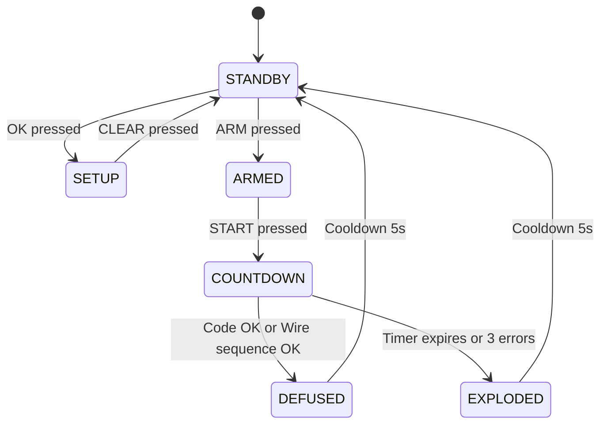

# 📋 BACKLOG — Feature da Implementare

**Ultimo aggiornamento**: 19 Dicembre 2025

Questo documento elenca tutte le feature in backlog, ordinate per priorità e milestone.

---

## 📊 Riepilogo Priorità

| Priorità | Quantità | Milestone | Stima Totale |
|----------|----------|-----------|--------------|
| 🔴 CRITICAL (MVP) | 3 | M1: MVP Stabile | 12-16 ore |
| 🟡 HIGH (MVP) | 2 | M1: MVP Stabile | 8-12 ore |
| 🟠 MEDIUM (Enhancement) | 6 | M2: Enhancement | 15-20 ore |
| 🟢 LOW (Optional) | 6 | M3: TacBomb Parity | 24-32 ore |

**TOTALE BACKLOG**: 17 task, 59-80 ore (7-10 giorni lavorativi)

---

## 🔴 MILESTONE 1: MVP Stabile (Task 004-008)

Target: Sistema completo display + keypad + countdown funzionante e stabile

### Task #004: Display Integration Testing

**Priorità**: 🔴 CRITICAL  
**Stima**: 4-6 ore  
**Dipendenze**: Task 001 (Display Flickering Fix)

#### Obiettivo
Validazione completa DisplayController standalone: multiplexing, colon blink, rotazione D3/D4, timing preciso.

#### Scope
```gherkin
Given: Display 7-segmenti + 74HC595 connessi
When: displayTime(12, 34) chiamato
Then: Display mostra "12:34" con colon visibile

Given: Colon blink abilitato
When: 500ms passano
Then: Colon (:) cambia stato ON↔OFF, visibile in Wokwi

Given: D3 e D4 fisicamente ruotati 180° in diagram.json
When: Display aggiornato con time 56:78
Then: Cifre D3/D4 appaiono dritte (rotation bitmap corretto)

Given: Multiplexing attivo
When: Misurato con oscilloscopio/timing
Then: Refresh rate 50Hz (5ms per digit), no ghosting tra digit
```

#### Testing Checklist
- [ ] Timing profiling: loop time avg, refresh() call frequency
- [ ] Visual inspection Wokwi: colon blink visible?
- [ ] Segment encoding: tutti i digit 0-9 leggibili
- [ ] DP bits test: solo D2/D3 mostrano colon dots
- [ ] Long-run stability: 1 ora continuous operation, no glitch

---

### Task #005: Keypad + Countdown Integration

**Priorità**: 🔴 CRITICAL  
**Stima**: 6-8 ore  
**Dipendenze**: Task 002, Task 003, Task 004

#### Obiettivo
Integrare KeypadController + CountdownController + DisplayController in workflow completo di editing time.

#### Scope
```gherkin
Given: Sistema in CLOCK mode
When: KEY_A premuto
Then: Passa a COUNTDOWN_EDIT mode, cursor lampeggia su H1

Given: COUNTDOWN_EDIT mode attivo, cursor su H1
When: KEY_6 (RIGHT) premuto
Then: Cursor si sposta a H2

Given: Cursor su posizione corrente
When: KEY_2 (UP) premuto
Then: Digit incrementato con validation rules

Given: Time editing completato (es. 15:30)
When: KEY_A premuto (toggle MODE)
Then: Torna a CLOCK mode, time aggiornato su display
```

#### Implementation Details
- Collegare handleKeyPress() a CountdownController methods
- Implementare cursor blink visual feedback (500ms toggle)
- Aggiungere MODE toggle state machine
- Display refresh prioritization: refresh() → keypad scan → countdown logic

#### Testing Checklist
- [ ] Workflow end-to-end: CLOCK → EDIT → modify time → back to CLOCK
- [ ] Cursor navigation: LEFT/RIGHT wrap correctness
- [ ] Digit editing: UP/DOWN con validation (max 23:59)
- [ ] Display stability: no flickering durante editing
- [ ] Mode persistence: time edited rimane dopo toggle

---

### Task #006: Full System Integration Test

**Priorità**: 🟡 HIGH  
**Stima**: 4-6 ore  
**Dipendenze**: Task 005

#### Obiettivo
Test di sistema completo con tutti i subsystem attivi contemporaneamente.

#### Scope
```gherkin
Given: Firmware completo (boot + display + keypad + countdown + battery + serial)
When: Sistema acceso
Then: Boot sequence → Display ready → Keypad responsive → Battery LEDs attivi

Given: Sistema in operation
When: Stress test (100 key presses, 1 ora runtime)
Then: No crash, no memory leak, display stabile, battery monitor funzionante

Given: Modalità DEBUG attiva
When: Stats monitorate ogni 10s
Then: RAM usage stabile (<80%), no increasing trend

Given: Tutti i comandi seriali testati (s/i/r/h/t)
When: Ogni comando inviato
Then: Output corretto, sistema responsive
```

#### Test Matrix
| Subsystem | Feature | Status | Pass/Fail |
|-----------|---------|--------|-----------|
| Boot | LED sequence R→O→G | ⬜ | ⬜ |
| Display | Time display stable | ⬜ | ⬜ |
| Display | Colon blink visible | ⬜ | ⬜ |
| Keypad | All 16 keys working | ⬜ | ⬜ |
| Countdown | Cursor navigation | ⬜ | ⬜ |
| Countdown | Digit edit validation | ⬜ | ⬜ |
| Battery | 4 LED thresholds | ⬜ | ⬜ |
| Serial | Commands s/i/r/h/t | ⬜ | ⬜ |
| Memory | RAM < 80% | ⬜ | ⬜ |
| Stability | 1h continuous run | ⬜ | ⬜ |

---

### Task #007: Countdown Running Mode (Timer Decrement)

**Priorità**: 🟡 HIGH  
**Stima**: 4-6 ore  
**Dipendenze**: Task 005

#### Obiettivo
Implementare countdown timer che decrementa automaticamente da time impostato fino a 00:00.

#### Scope
```gherkin
Given: Time impostato a 10:00
When: START button premuto (o trigger evento)
Then: Countdown inizia decremento, display aggiorna ogni secondo

Given: Countdown running a 09:45
When: 1 secondo passa
Then: Display mostra 09:44

Given: Countdown running a 00:01
When: 1 secondo passa
Then: Display mostra 00:00, countdown STOP

Given: Countdown attivo
When: STOP button premuto
Then: Countdown pause, time congelato

Given: Countdown in pause
When: RESET button premuto
Then: Time torna a valore impostato originale
```

#### Implementation Details
- Usare millis() timer non-blocking per decremento 1 sec
- Stato machine: STOPPED → RUNNING → PAUSED → EXPIRED
- Display update solo quando time cambia (not every loop)
- Opzionale: audio beep ogni secondo (BuzzerController integration)

#### TacBomb Integration Note
Questo task è foundation per TacBomb game logic (ARMED → COUNTDOWN → DEFUSED/EXPLODED states). Dopo MVP stabile, espandibile con:
- Penalty time (errori sottraggono secondi)
- Beep acceleration (ultimo minuto: beep faster)
- Explosion trigger a 00:00

---

### Task #008: Memory Budget Documentation

**Priorità**: 🟠 MEDIUM  
**Stima**: 2-3 ore  
**Dipendenze**: Task 006

#### Obiettivo
Documentare dettagliato uso RAM/Flash per ogni modulo, creare budget tracking sheet.

#### Scope
- Profilare ogni modulo individualmente (RAM + Flash)
- Creare tabella memory breakdown by feature
- Definire target limits per future features (<80% RAM rule)
- Identificare optimization opportunities

#### Deliverable: `docs/MEMORY_BUDGET.md`
```markdown
## RAM Usage Breakdown (Total: 2048 bytes)

| Module | Global Vars | Stack Est. | Total | % |
|--------|-------------|-----------|-------|---|
| DisplayController | 50 | 20 | 70 | 3.4% |
| KeypadController | 20 | 10 | 30 | 1.5% |
| CountdownController | 10 | 5 | 15 | 0.7% |
| BatteryMonitor | 20 | 5 | 25 | 1.2% |
| SystemInitializer | 30 | 10 | 40 | 2.0% |
| main.cpp globals | 100 | 50 | 150 | 7.3% |
| Arduino core | - | - | 200 | 9.8% |
| Stack reserve | - | - | 400 | 19.5% |
| **TOTAL USED** | - | - | **930** | **45.4%** |
| **FREE** | - | - | **1118** | **54.6%** |

Target for MVP: < 1638 bytes (80% threshold)
```

---

## 🟠 MILESTONE 2: Enhancements (Task 009-014)

Target: Miglioramenti qualità, test automation, polish UX

### Task #009: Battery Monitor with Hysteresis

**Priorità**: 🟠 MEDIUM  
**Stima**: 3-4 ore  
**Dipendenze**: Task 006

#### Obiettivo
Refactoring battery monitor da procedural a state machine con hysteresis bands per evitare LED flapping.

#### Enhancement
```gherkin
Given: Voltage oscilla tra 2.45V e 2.55V (vicino threshold 2.50V)
When: Sistema legge ADC ripetutamente
Then: LED non flappano (hysteresis band ±0.1V applicata)

Given: Stato corrente GOOD (LED giallo)
When: Voltage scende da 2.51V a 2.49V
Then: LED rimane giallo (dentro hysteresis band)

Given: Voltage scende ulteriormente a 2.39V
When: Sistema aggiorna stato
Then: LED passa a arancione (LOW state), con entry action log
```

#### Implementation
Vedere `EPIC_01.md` per state machine design completo con:
- Stati: FULL → GOOD → LOW → CRITICAL
- Transition thresholds con hysteresis (upper/lower bounds)
- Entry/exit actions per stato
- Moving average filter (optional, 10 samples)

---

### Task #010: Colon Visual Verification

**Priorità**: 🟠 MEDIUM  
**Stima**: 2-3 ore  
**Dipendenze**: Task 004

#### Obiettivo
Verificare visivamente colon blink funzionante in Wokwi e hardware reale.

#### Scope
- Aggiungere debug serial output per colon state
- Test visuale prolungato (5 min) con timing measurement
- Verificare DP bits raggiungono display (oscilloscope trace)
- Adjustare timing se necessario (default 500ms blink rate)

---

### Task #011: Serial Command Improvements

**Priorità**: 🟢 LOW  
**Stima**: 2-3 ore  
**Dipendenze**: Task 006

#### New Commands
- `m`: Toggle display mode (CLOCK ↔ COUNTDOWN_EDIT)
- `v`: Show voltage reading (ADC value + converted voltage)
- `k`: Keypad test mode (shows key presses in real-time)
- `d`: Display test (cycles through all digits 0-9)

---

### Task #012: Unit Test Framework Setup

**Priorità**: 🟡 HIGH  
**Stima**: 4-6 ore  
**Dipendenze**: Nessuna (può essere parallelo)

#### Obiettivo
Setup Unity test framework con test cases per CountdownController e battery thresholds.

#### Deliverables
```
test/
  └── test_embedded/
      ├── test_countdown.cpp      # Digit validation, cursor logic
      ├── test_battery.cpp         # Threshold checks, hysteresis
      ├── test_keypad.cpp          # Debounce, matrix scan
      └── test_display.cpp         # Segment encoding, rotation
```

#### Example Tests
```cpp
void test_countdown_h1_max_is_2() {
    CountdownController cd;
    cd.setTime(2, 0);
    cd.incrementDigit(); // H1: 2 → 0 (wrap)
    uint8_t h, m;
    cd.getTime(h, m);
    TEST_ASSERT_EQUAL(0, h);
}

void test_battery_threshold_full() {
    float voltage = 3.80f;
    BatteryState state = getBatteryState(voltage);
    TEST_ASSERT_EQUAL(BATTERY_FULL, state);
}
```

#### CI/CD Integration
- GitHub Actions workflow per `pio test` su ogni commit
- Badge README.md con test pass rate

---

### Task #013: Wokwi Circuit Validation

**Priorità**: 🟢 LOW  
**Stima**: 2-3 ore  
**Dipendenze**: Task 004

#### Scope
- Verificare tutte le connessioni `diagram.json` matchano pinout code
- Test rotazione display D3/D4 (180°) visivamente
- Screenshot reference per documentazione
- Validate wire colors consistenti con convenzioni

---

### Task #014: Code Documentation Pass

**Priorità**: 🟢 LOW  
**Stima**: 3-4 ore  
**Dipendenze**: Task 006

#### Scope
- Doxygen comments per tutte le public API
- README.md update con section keypad + countdown
- Flowcharts update per nuovi subsystems
- Esempio code snippets per common use cases

---

## 🟢 MILESTONE 3: TacBomb Feature Parity (Task 015-020)

Target: Implementazione completa features TacBomb Pro (opzionale post-MVP)

### Task #015: LED RGB Status Indicator

**Priorità**: 🟢 LOW  
**Stima**: 3-4 ore  
**Source**: `TacBomb_Pro_Development_Complete.md` EPIC 8 (LED Status)

#### Obiettivo
Aggiungere LED RGB per indicazione stato dispositivo con color mapping e pattern blink.

#### Hardware
- LED RGB common cathode su pins 14/15/16 (R/G/B)
- Resistenze 330Ω per ogni channel

#### Color Mapping (TacBomb Spec)
| Stato | Colore | Pattern | Nota |
|-------|--------|---------|------|
| STANDBY | Verde fisso | - | Ready |
| ARMED | Giallo fisso | - | Countdown armed |
| COUNTDOWN | Rosso lampeggiante | Slow (1Hz) | Normal |
| COUNTDOWN (<60s) | Rosso lampeggiante | Fast (4Hz) | Warning |
| DEFUSED | Verde lampeggiante | Medium (2Hz) | Success |
| EXPLODED | Rosso fisso | - | Game over |

#### Implementation
- Vedere `TacBomb_Pro_Schematic.md` per circuit details (linee 780-840)
- PWM per brightness control (opzionale)

---

### Task #016: Wire Sensing (ADC Ladder)

**Priorità**: 🟢 LOW  
**Stima**: 6-8 ore  
**Source**: `TacBomb_Pro_Development_Complete.md` EPIC 3 (Wire Sensing)

#### Obiettivo
Sistema di rilevamento taglio fili con resistor ladder su ADC pin.

#### Hardware
- 4 fili colorati (R/O/Y/G) connessi a morsettiere
- Resistor ladder: 1kΩ, 2.2kΩ, 4.7kΩ, 10kΩ (vedi schematic completo)
- ADC pin A4 legge voltage combinato

#### Voltage Lookup Table
| Fili Connessi | ADC Value | Voltage | Wire State |
|---------------|-----------|---------|------------|
| 1111 (tutti) | ~920 | 4.50V | 0b1111 |
| 1110 (3 connessi) | ~850 | 4.15V | 0b1110 |
| ... | ... | ... | ... |
| 0000 (tutti tagliati) | ~0 | 0.00V | 0b0000 |

#### Scope
- Wire cut detection con edge triggering
- Sequenza validation (order matters!)
- Noise immunity (ADC threshold bands)
- Vedere `TacBomb_Pro_Schematic.md` linee 552-638 per logic completa

---

### Task #017: Game State Machine (TacBomb Logic)

**Priorità**: 🟢 LOW  
**Stima**: 8-10 ore  
**Source**: `TacBomb_Pro_Development_Complete.md` EPIC 4 (Game Logic)

#### Obiettivo
State machine completa per game flow TacBomb: ARMED → COUNTDOWN → DEFUSED/EXPLODED.

#### States


#### Features
- Code generation (random 4-digit 0000-9999)
- Wire sequence generation (random permutation)
- Error counting (max 3 errors → EXPLODED)
- Time penalty (-30s per error)
- Defusal verification

#### Implementation
Vedere `TacBomb_Pro_Development_Complete.md` linee 295-452 per:
- State transition table
- Guard conditions
- Entry/exit actions per state
- Event queue management

---

### Task #018: Audio Feedback System (Tones & Patterns)

**Priorità**: 🟢 LOW  
**Stima**: 3-4 ore  
**Source**: `TacBomb_Pro_Development_Complete.md` EPIC 5 (Audio)

#### Obiettivo
Espandere BuzzerController con pattern audio per eventi game.

#### New Patterns
| Evento | Pattern | Descrizione |
|--------|---------|-------------|
| Countdown tick | Beep 1000Hz 100ms | Ogni secondo |
| Countdown warning | Beep 1500Hz 50ms | Sotto 60s, beep accelerato |
| Countdown urgent | Beep 2000Hz 30ms | Sotto 10s, beep veloce |
| Code correct | Melodia rising | Toni crescenti 500→1000→1500Hz |
| Code wrong | 3× beep 200Hz 200ms | Tono basso, 3 beep |
| Explosion | Tone 200Hz 5s continuous | Sirena |

#### Implementation
- Non-blocking audio con Timer2 CTC mode
- Melody sequencer per pattern complessi
- Volume control (opzionale, PWM duty cycle)

---

### Task #019: Ghost Wire Easter Egg

**Priorità**: 🟢 LOW  
**Stima**: 4-6 ore  
**Source**: `TacBomb_Pro_Development_Complete.md` EPIC 6 (Ghost Wire)

#### Obiettivo
Sequenza segreta "ghost" che disinnesca bomba anche se diversa da sequenza ufficiale.

#### Logic
```gherkin
Given: Sistema genera sequenza normale [R, G] E sequenza ghost [Y, O]
When: Giocatore taglia Y → O (sequenza ghost)
Then: Bomba disinnescata immediatamente, LED rainbow, melodia speciale

Given: Sequenza ghost parziale corretta [Y]
When: Giocatore taglia R (filo sequenza normale)
Then: Ghost tracking reset, continua con logica normale
```

#### Probabilità
- Lunghezza ghost: 2-4 fili (random)
- Probabilità match casuale: ~4-8% (vedi doc completo)
- Easter egg discovery incentive

#### Visual Feedback
- LED rainbow cycle (R→O→Y→G→B)
- Display mostra "GH05" (Ghost)
- Melodia vittoria speciale

---

### Task #020: Hardware PCB Design & Migration

**Priorità**: 🟢 LOW  
**Stima**: 16-20 ore (multi-phase)  
**Source**: `TacBomb_Pro_Schematic.md` + `TacBomb_Pro_Design_Document.md`

#### Obiettivo
Progettazione PCB professionale per produzione, migrazione da breadboard/Wokwi a hardware reale.

#### Phases
1. **Phase A**: Schematic capture in KiCad (4-6h)
   - Importare netlist da TacBomb_Pro_Schematic.md
   - Component placement optimization
   - DRC (Design Rule Check)

2. **Phase B**: PCB layout (6-8h)
   - 2-layer PCB 100×80mm
   - Component footprints (SMD vs THT decision)
   - Trace routing (power, ground planes)
   - Mounting holes for case

3. **Phase C**: BOM & Assembly (4-6h)
   - Generate BOM from KiCad
   - Source components (LCSC, DigiKey, Mouser)
   - Assembly instructions for JLCPCB SMT service
   - Cost analysis (target: <€20/unit at 100pz)

4. **Phase D**: Prototype & Testing (2-3h)
   - Order 5pz PCB from JLCPCB
   - Assembly and smoke test
   - Firmware flash via FTDI/ISP
   - Validation against breadboard version

#### Deliverables
```
hardware/
  ├── schematic.kicad_sch
  ├── pcb.kicad_pcb
  ├── BOM.csv
  ├── gerbers/ (ZIP per fab)
  ├── assembly_guide.pdf
  └── photos/ (assembled boards)
```

#### Notes
- KiCad netlist già disponibile in `TacBomb_Pro_KiCad_Netlist.txt`
- Design document ha analisi costi dettagliata (€43 prototipo → €16 produzione)
- Case IP65 200×120×75mm già specificato

---

## 📊 Backlog Summary by Category

### By Feature Type
| Tipo | Count | Stima |
|------|-------|-------|
| Integration/Testing | 4 | 16-22h |
| Enhancement | 6 | 18-25h |
| TacBomb Features | 6 | 40-52h |
| Documentation | 1 | 2-3h |

### By Complexity
| Complessità | Count | Avg Stima |
|-------------|-------|-----------|
| Simple (2-4h) | 5 | 3h |
| Medium (4-8h) | 8 | 6h |
| Complex (8-20h) | 4 | 12h |

### By Hardware Requirement
| Req Hardware | Count | Note |
|--------------|-------|------|
| No (software only) | 9 | Testable in Wokwi |
| Yes (new components) | 8 | Richiede wire terminals, LED RGB, etc. |

---

## 🔄 Backlog Management

### Prioritization Criteria
1. **Blockers**: Fix bugs che bloccano altri task
2. **MVP Critical**: Features essenziali per prodotto minimo utilizzabile
3. **User Value**: Features con alto impatto su UX
4. **Technical Debt**: Refactoring per stabilità long-term
5. **Nice-to-Have**: Features opzionali per completezza

### Grooming Schedule
- **Weekly**: Review priorità task 004-014 (MVP + Enhancement)
- **Monthly**: Review task 015-020 (TacBomb parity) se MVP completato
- **Quarterly**: Hardware roadmap evaluation (Task 020)

### Dependencies Map
```
Task 001 (Display Fix) ← BLOCKER per tutto
    ├─→ Task 002 (Keypad Test)
    ├─→ Task 003 (Countdown Test)
    └─→ Task 004 (Display Integration Test)
        ├─→ Task 005 (Keypad+Countdown Integration)
        │   ├─→ Task 006 (Full System Test)
        │   │   └─→ Task 008 (Memory Budget Doc)
        │   └─→ Task 007 (Countdown Running Mode)
        ├─→ Task 010 (Colon Visual Verification)
        └─→ Task 013 (Wokwi Circuit Validation)

Task 006 (Full System Test) ← GATE per enhancements
    ├─→ Task 009 (Battery Hysteresis)
    ├─→ Task 011 (Serial Commands)
    └─→ Task 014 (Documentation Pass)

Task 012 (Unit Test Setup) ← Parallel, no dependencies

Task 006 + Task 007 ← GATE per TacBomb features
    ├─→ Task 015 (LED RGB)
    ├─→ Task 016 (Wire Sensing)
    ├─→ Task 017 (Game State Machine)
    ├─→ Task 018 (Audio System)
    └─→ Task 019 (Ghost Wire)

Task 017 (Game State Machine) ← GATE per hardware
    └─→ Task 020 (PCB Design)
```

---

## 📝 Notes

- **MVP Go-Live Gate**: Task 001-008 devono essere completati e testati
- **TacBomb Features**: Task 015-020 sono opzionali, dipendono da decisione product
- **Hardware Investment**: Task 020 richiede budget materiali (~€200-300 per 5 prototipi PCB)
- **Timeline Realistico**: MVP = 3-4 settimane, Full TacBomb = 6-8 settimane addizionali

Per task in corso, vedere `IN_PROGRESS.md`.  
Per task completati, vedere `DONE.md`.  
Per timeline visuale, vedere `GANTT.md`.
