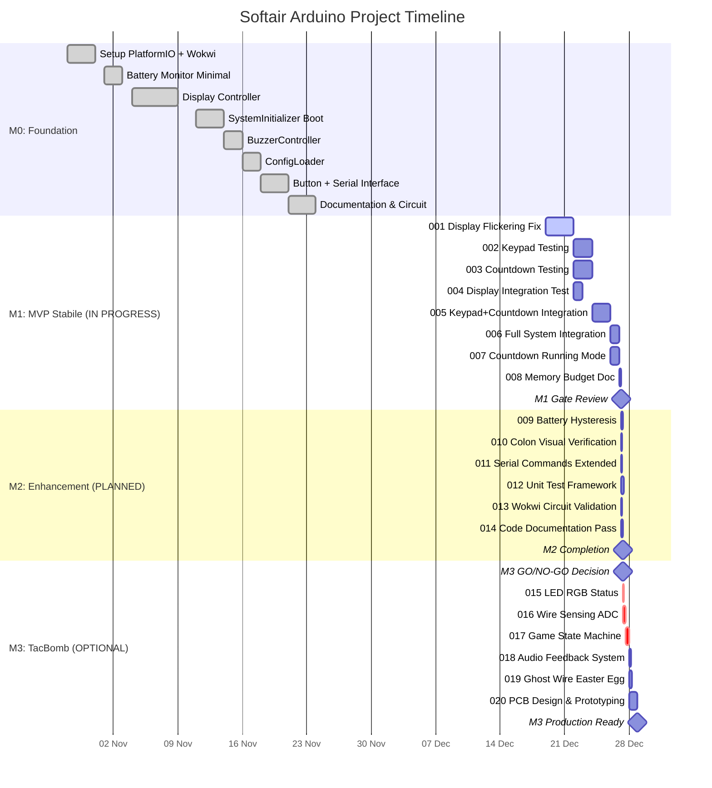
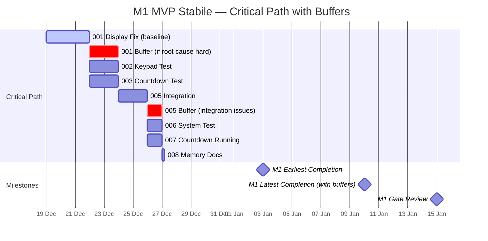

# 📊 GANTT — Timeline Visuale Progetto

**Ultimo aggiornamento**: 19 Dicembre 2025  
**Periodo**: Dicembre 2025 - Marzo 2026 (16 settimane)

---

## 📅 Gantt Chart Completo



---

## 📊 Timeline per Milestone

### Milestone 0: Foundation (COMPLETATO ✅)
```
Oct 28 ──────────────────────────── Nov 25 (4 settimane)
│                                            │
├─ Setup PlatformIO (3d)                     │
├─ Battery Monitor (2d)                      │
├─ Display Controller (5d)                   │
├─ Boot Sequence (3d)                        │
├─ Buzzer (2d)                               │
├─ Config (2d)                               │
├─ Button + Serial (3d)                      │
└─ Docs (3d)                                 ✓
```

**Totale**: 22 giorni lavorativi (4 settimane calendario)

---

### Milestone 1: MVP Stabile (IN PROGRESS 🔧)
```
Dec 19 ──────────────────────────── Jan 15 (4 settimane)
│                                            │
├─ [001] Display Fix (3d) ◄───── YOU ARE HERE
│    ├─ [002] Keypad Test (2d) ──┐
│    ├─ [003] Countdown Test (2d) ┘ [parallel]
│    └─ [004] Display Integration (1d)
│         └─ [005] Keypad+Countdown Integration (2d)
│              ├─ [006] Full System Test (1d)
│              └─ [007] Countdown Running (1d)
│                   └─ [008] Memory Docs (4h)
│                        └─ M1 GATE REVIEW ▶
```

**Critical Path**: 001 → 002/003 → 005 → 006 → M1_GATE  
**Totale stima**: 12-14 giorni lavorativi (3-4 settimane calendario)  
**Slack**: 2-3 giorni (buffer per debugging)

#### Task Dependencies (Detailed)
```
001 (Display Fix)
 ├─→ 002 (Keypad Test)
 ├─→ 003 (Countdown Test)  } Parallel OK
 └─→ 004 (Display Integration)
      └─→ 005 (Keypad+Countdown Integration)
           ├─→ 006 (Full System Test)
           │    └─→ 008 (Memory Docs)
           └─→ 007 (Countdown Running)
```

---

### Milestone 2: Enhancement (PLANNED 📋)
```
Jan 16 ──────────────────────────── Feb 6 (3 settimane)
│                                            │
└─ M1 GATE ▶
    ├─ [009] Battery Hysteresis (4h) ──┐
    ├─ [010] Colon Verification (3h)   │ [parallel]
    ├─ [011] Serial Commands (3h)      │
    ├─ [012] Unit Tests (6h)           │
    ├─ [013] Wokwi Validation (3h)     │
    └─ [014] Documentation (4h)        ┘
         └─ M2 COMPLETE ▶
```

**Parallelization**: Task 009-014 possono essere eseguiti in ordine variabile  
**Totale stima**: 23 ore (3 giorni lavorativi)  
**Timeline reale**: 2 settimane (con testing esteso e polish)

---

### Milestone 3: TacBomb Parity (OPTIONAL 🟢)
```
Feb 7 ──────────────────────────── Mar 21 (6 settimane)
│                                            │
└─ M3 GO/NO-GO DECISION ▶
    ├─ [015] LED RGB (4h)
    ├─ [016] Wire Sensing (8h)
    │    └─ [017] Game State Machine (10h) ◄─ Critical Path
    │         ├─ [018] Audio System (4h)
    │         ├─ [019] Ghost Wire (6h)
    │         └─ [020] PCB Design (20h) ◄─ Longest task
    │              └─ M3 PRODUCTION READY ▶
```

**Critical Path**: M3_DECISION → 016 → 017 → 020  
**Totale stima**: 52 ore (6-7 giorni lavorativi)  
**Timeline reale**: 6 settimane (include PCB fab lead time 2-3 settimane)

#### Sequential Constraints
```
017 (Game State Machine) è GATE per:
 ├─→ 018 (Audio System) — needs game events
 ├─→ 019 (Ghost Wire) — needs state machine hooks
 └─→ 020 (PCB Design) — needs final pinout stable

020 (PCB Design) ha external dependency:
 └─→ JLCPCB fab: 2-3 settimane lead time
      └─→ Components sourcing: 1 settimana
           └─→ Assembly + testing: 3-5 giorni
```

---

## 📊 Resource Loading Chart

```
Effort (hours/week)
40 │                                    ╔════════╗
   │                         ╔═════════ ║  M3    ║
   │              ╔═════════ ║  M2     ║║ (opt) ║
30 │   ╔═════════ ║  M1     ║║ (enh.) ║║        ║
   │   ║  M0     ║║ (MVP)   ║╚════════╝╚════════╝
20 │   ║ (done)  ║║         ║
   │   ║         ║║         ║
10 │   ║         ║║         ║
   │   ║         ║║         ║
 0 └───╨─────────╨╨─────────╨──────────────────────
   Oct│    Nov   │Dec   Jan │ Feb      Mar    Apr
   
   Legend:
   ╔══╗ Development effort
   ═══  Sustained high effort
   ───  Planning/documentation
```

### Weekly Breakdown (M1 Phase)

| Week | Tasks | Est. Hours | Actual | Notes |
|------|-------|-----------|--------|-------|
| Dec 16-22 | Task 001 investigation | 24h | TBD | Display flickering root cause |
| Dec 23-29 | Task 001 fix + 002/003 start | 30h | TBD | Holidays slow-down expected |
| Dec 30-Jan 5 | Task 002/003/004 completion | 24h | TBD | New Year slow-down |
| Jan 6-12 | Task 005/006/007 integration | 30h | TBD | Final push M1 |
| Jan 13-19 | Task 008 + M1 Gate Review | 16h | TBD | Documentation & validation |

**Total M1 effort**: ~124 ore (≈ 3.1 settimane full-time equivalent)

---

## 🔄 Gantt with Risk Buffers



**Buffer Strategy**:
- Task 001: +2 giorni se root cause non è keypad scan timing
- Task 005: +1 giorno se integration rivela edge cases
- Total slack: 5 giorni tra earliest e gate review date

---

## 📊 Milestone Gantt (High-Level)

```mermaid
gantt
    title Project Milestones — Softair Arduino
    dateFormat YYYY-MM-DD
    axisFormat %b '%y
    
    section Milestones
    M0: Foundation Complete         :done, m0, 2025-10-28, 2025-11-25
    M1: MVP Stabile Gate            :active, m1, 2025-12-19, 2026-01-15
    M2: Enhancement Complete        :m2, 2026-01-16, 2026-02-06
    M3: TacBomb Parity (Optional)   :m3, 2026-02-07, 2026-03-21
    
    section Key Dates
    Project Kickoff                 :milestone, kick, 2025-10-28, 0d
    M0 Completion                   :milestone, m0_done, 2025-11-25, 0d
    Holiday Break                   :crit, holiday, 2025-12-24, 2026-01-01
    M1 Gate Review                  :milestone, m1_gate, 2026-01-15, 0d
    M2 Completion                   :milestone, m2_done, 2026-02-06, 0d
    M3 GO/NO-GO Decision            :milestone, m3_decision, 2026-02-06, 0d
    Q1 End / Project Review         :milestone, q1_end, 2026-03-31, 0d
```

---

## 🎯 Task Priority Heatmap

Visualizzazione priorità task per resource allocation:

```
        │ Urgency
    ────┼─────────────────────────────────
     ^  │
     │  │  001 ◄──── NOW (Blocker critico)
     │  │  
  HIGH │  002  003  004  005  (MVP path)
     │  │  
     │  │  006  007  008  (MVP completion)
     │  │  
   MED │  009  010  011  012  (Enhancement)
     │  │  
     │  │  013  014  (Polish)
     │  │
   LOW │  015  016  017  018  019  020  (Optional)
     │  │
     v  │
    ────┴─────────────────────────────────
         LOW      MED      HIGH  → Importance
         
   Legend:
   001-008: Must complete for MVP
   009-014: Should complete for quality
   015-020: Nice to have (TacBomb full features)
```

---

## 📅 Calendar View (January 2026 — MVP Critical Month)

```
January 2026                   
Su Mo Tu We Th Fr Sa
         1  2  3  4  
 5  6  7  8  9 10 11  ← Week 1: Task 001 fix complete, 002/003 start
12 13 14 15 16 17 18  ← Week 2: Integration 005, System test 006
19 20 21 22 23 24 25  ← Week 3: Polish, Memory docs, Gate prep
26 27 28 29 30 31     ← Week 4: M1 Gate Review + buffer

Key Dates:
• Jan 3:  Task 001 completion target (best case)
• Jan 10: Task 001 completion target (worst case with buffer)
• Jan 15: M1 Gate Review (GO/NO-GO for M2)
```

---

## 🔢 Quantitative Metrics

### Velocity Tracking

| Sprint | Planned Hours | Actual Hours | Completed Tasks | Velocity |
|--------|---------------|--------------|-----------------|----------|
| M0 Foundation | 176h | ~180h | 8/8 | 102% |
| M1 Sprint 1 (001) | 24h | TBD | 0/1 | TBD |
| M1 Sprint 2 (002-004) | 30h | TBD | 0/3 | TBD |
| M1 Sprint 3 (005-007) | 32h | TBD | 0/3 | TBD |
| M1 Sprint 4 (008+gate) | 16h | TBD | 0/1 | TBD |

**Velocity calculation**: (Actual Completed / Planned) × 100%  
**Target velocity**: 90-110% (within ±10% estimate accuracy)

### Cumulative Flow Diagram (Conceptual)

```
Tasks Count
20 │                                        ╱DONE
   │                                   ╱────
   │                              ╱────     
15 │                         ╱────    IN PROGRESS
   │                    ╱────         
   │               ╱────              
10 │          ╱────                   
   │     ╱────                        BACKLOG
   │╱────                             
 5 │                                  
   │                                  
 0 └──────────────────────────────────────────────
   Nov   Dec   Jan   Feb   Mar   Apr
   
Healthy flow: Steady migration from BACKLOG → IN PROGRESS → DONE
Warning signs: Tasks stuck in IN PROGRESS, BACKLOG not decreasing
```

---

## 🛠️ Tools & Automation

### Gantt Chart Generation
Questo file usa Mermaid syntax per gantt interattivi:
- **VS Code Extension**: Mermaid Preview (built-in in GitHub/GitLab)
- **Export**: Mermaid Live Editor → SVG/PNG per presentazioni
- **Update Frequency**: Settimanale (adjust date/duration based on actual progress)

### Progress Tracking
```bash
# Script per auto-update progress percentages
# (Future automation, manual per ora)
./scripts/update_gantt.sh  # Parse DONE/IN_PROGRESS/BACKLOG.md
                           # Generate updated mermaid gantt
                           # Commit changes
```

---

## 📝 Change Log

### v1.0 (19 Dicembre 2025)
- Initial GANTT chart creation
- M0-M3 milestones visualized
- Critical path identified: 001 → 005 → 006 → M1_GATE
- Risk buffers added for tasks 001 and 005
- Resource loading chart created

### Next Update (Planned)
**Date**: 26 Dicembre 2025 (post-001 completion)  
**Changes**:
- Update task 001 actual duration
- Adjust task 002/003 start dates based on 001 completion
- Revise M1 gate date if slippage detected

---

**GANTT Ownership**: Antonio Cittadino  
**Update Frequency**: Settimanale (ogni Lunedì)  
**Last Sync with Codebase**: 19 Dicembre 2025

Per dettagli task, vedere:
- `ROADMAP.md` — Milestone descriptions e success criteria
- `IN_PROGRESS.md` — Task attivi con acceptance criteria
- `BACKLOG.md` — Task future con dependencies
- `DONE.md` — Task completati con lessons learned
